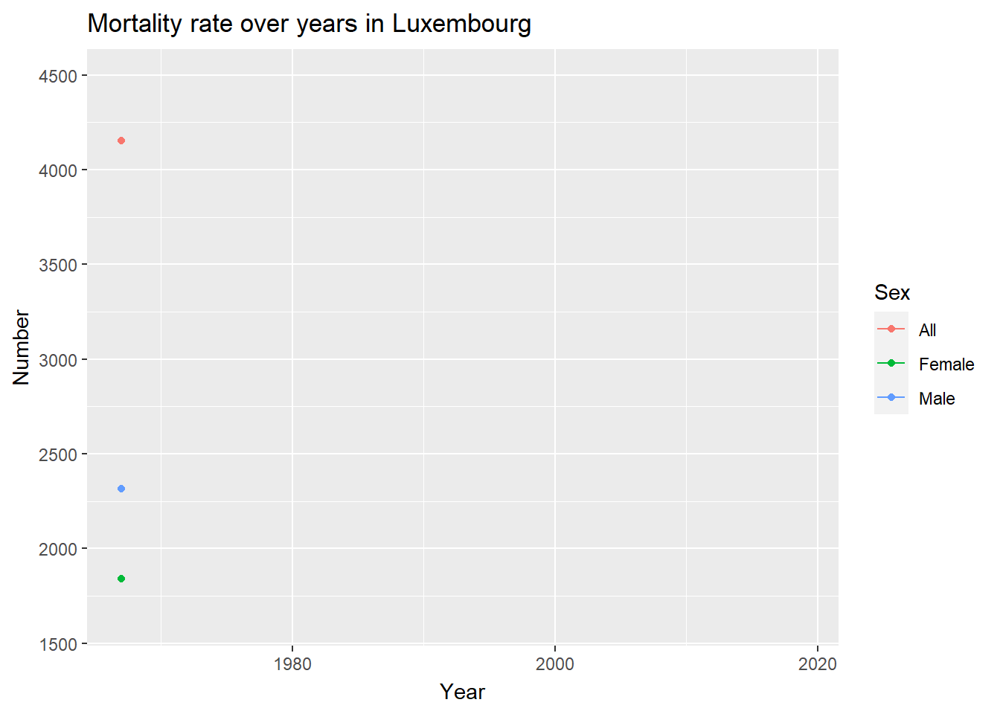
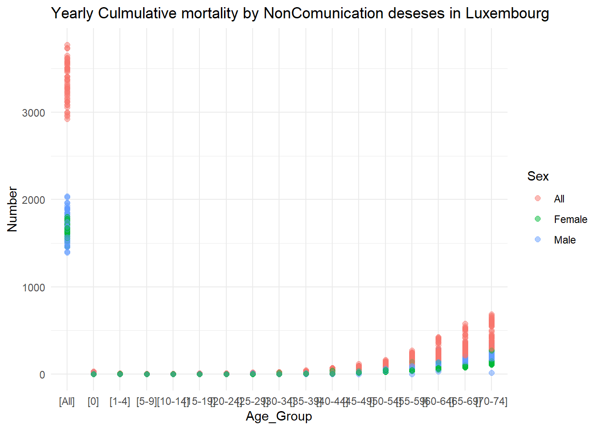
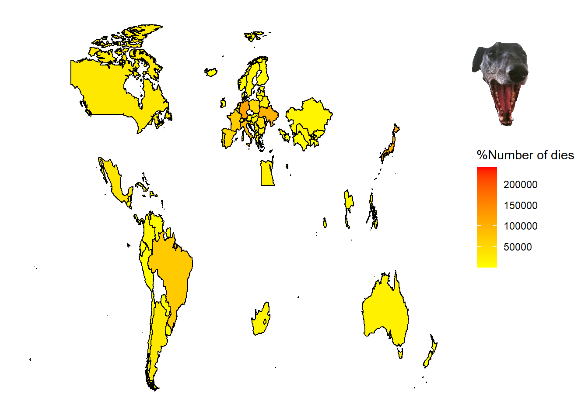
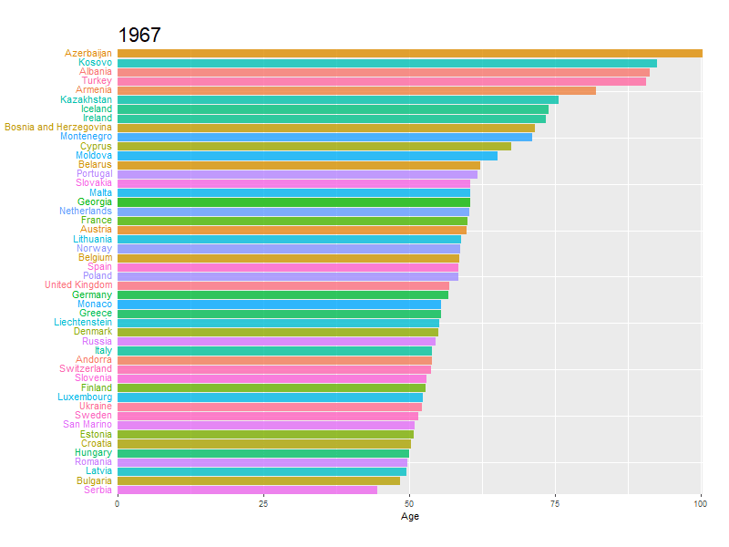

<div class="card">
<div class="card-header">
Data Set
</div>
<blockquote>
The professor suggested that it would be more efficient to download the datasets directly using the provided links on the website. However, the source of the datasets was set up in a way that did not allow for copying the links. As a result, I had to download the datasets directly from the website. The datasets used in this study include: 'What causes contribute to mortality rates in Luxembourg', 'Non communication in Luxembourg', and 'Population by age group'. The links for these datasets are as follows: <a href="https://platform.who.int/mortality/countries/country-details/MDB/luxembourg">What causes contribute to mortality rates in Luxembourg, from the website "platform.who" </a>, <a href="https://platform.who.int/mortality/themes/theme-details/MDB/noncommunicable-diseases">Non communication in Luxembourg</a>, and <a href="https://ourworldindata.org/age-structure">Population by age group, source "ourworldindata.org"</a>.
</blockquote>


</div> 
<br/><br/>


<div class="card">
<div class="card-header">
Examining Temporal Trends and Gender Disparities in Mortality Rates, 1960-2021.
</div>
  

<div class="card-body">
The objective of this study is to investigate the temporal dynamics of mortality rates from 1960 to 2021, encompassing individuals of all age groups. A key focus of the analysis will be to assess potential disparities in mortality rates between males and females.
        

<!-- -->
</div>

<div class="card-footer">
<blockquote>
We notice that in Luxembourg, the mortality rate was very high in 1960.because in Luxembourg there have been several epidemics that could affect lives.However, from 1960 to 2020, this rate has decreased. This makes sense, because Luxembourg has adopted more modern treatment methods.
 </blockquote>
</div>

</div>

<br/><br/>

<div class="card">
<div class="card-header">
We shall now analyze some major causes of mortality in luxembourg and how these causes have affected different age groups.
</div>
  
<div class="card-body">


```
# A tibble: 193 × 2
   Indicator_Name                            n
   <chr>                                 <int>
 1 All Causes                             2703
 2 Appendicitis                           2703
 3 Birth asphyxia and birth trauma        2703
 4 Breast cancer                          2703
 5 Cardiovascular diseases                2703
 6 Cataracts                              2703
 7 Cerebrovascular disease                2703
 8 Childhood-cluster diseases             2703
 9 Chronic obstructive pulmonary disease  2703
10 Cirrhosis of the liver                 2703
# … with 183 more rows
```


</div>

<div class="card-footer">
<blockquote>
We have identified some of the major causes of mortality in Luxembourg over the years. According to our data, the number of deaths due to non-communicable diseases is quite high.

Deaths from cardiovascular diseases and cancer have been steadily decreasing, which may be due to improvements in sanitation infrastructure.

Cancer deaths appeared to be low in the years 2004, but then saw an increase around 2005 until 2021. This could be due to outbreaks of cancer or the aging of the Luxembourg population.

It is worth noting that the population of Luxembourg has been aging over this time period.

</blockquote>

  </div>
</div>
<br/><br/>


<div class="card">
<div class="card-header">
Given that non-communicable diseases are the leading cause of death,it's important to visualize the impact of these conditions on mortality by age group. This will allow us to identify which age brackets are most affected.
</div> 
<div class="card-body">


</div>

<div class="card-footer">
 <blockquote>
Here we plot the number of deaths from non-communication diseases for different age groups. From the graph, we can understand that the number of deaths due to non_communication issues is maximum for the age groups from 0 and also age groups between 54 and 74 years old. We also note that the number of deaths due to non-communication of illnesses is down slightly for the young population. The top no.

child deaths may be due to the fact that children of this age are not strong enough to resist this disease. It is noted that the number of deaths is also relatively higher among the elderly than among middle-aged adults. This may be the case with older people who do not have strong immunity against non-communication diseases.
 </blockquote>
</div>
</div>

<br/><br/>


<div class="card">
<div class="card-header">
We have determined that this disease disproportionately affects older individuals. As such, it is important to visualize how this disease has contributed to mortality trends from 1960 to 2021.
</div>
<div class="card-body">

```{=html}
<div id="htmlwidget-17c1864eeb1285646837" style="width:672px;height:480px;" class="plotly html-widget"></div>
<script type="application/json" data-for="htmlwidget-17c1864eeb1285646837">{"x":{"visdat":{"36fc105f666":["function () ","plotlyVisDat"]},"cur_data":"36fc105f666","attrs":{"36fc105f666":{"x":{},"y":{},"text":{},"hoverinfo":"text","size":{},"alpha_stroke":1,"sizes":[10,100],"spans":[1,20],"type":"scatter","mode":"markers","color":{},"frame":{},"ids":{},"inherit":true}},"layout":{"margin":{"b":40,"l":60,"t":25,"r":10},"xaxis":{"domain":[0,1],"automargin":true,"type":"log","title":"Number","range":[1.97169455736581,2.87683323883179]},"yaxis":{"domain":[0,1],"automargin":true,"title":"Age_Group","type":"category","categoryorder":"array","categoryarray":["[55-59]","[60-64]","[65-69]","[70-74]"]},"hovermode":"closest","showlegend":true,"sliders":[{"currentvalue":{"prefix":"YEAR ","xanchor":"right","font":{"size":16,"color":"red"}},"steps":[{"method":"animate","args":[["1967"],{"transition":{"duration":1000,"easing":"elastic"},"frame":{"duration":1000,"redraw":false},"mode":"immediate"}],"label":"1967","value":"1967"},{"method":"animate","args":[["1968"],{"transition":{"duration":1000,"easing":"elastic"},"frame":{"duration":1000,"redraw":false},"mode":"immediate"}],"label":"1968","value":"1968"},{"method":"animate","args":[["1969"],{"transition":{"duration":1000,"easing":"elastic"},"frame":{"duration":1000,"redraw":false},"mode":"immediate"}],"label":"1969","value":"1969"},{"method":"animate","args":[["1970"],{"transition":{"duration":1000,"easing":"elastic"},"frame":{"duration":1000,"redraw":false},"mode":"immediate"}],"label":"1970","value":"1970"},{"method":"animate","args":[["1971"],{"transition":{"duration":1000,"easing":"elastic"},"frame":{"duration":1000,"redraw":false},"mode":"immediate"}],"label":"1971","value":"1971"},{"method":"animate","args":[["1972"],{"transition":{"duration":1000,"easing":"elastic"},"frame":{"duration":1000,"redraw":false},"mode":"immediate"}],"label":"1972","value":"1972"},{"method":"animate","args":[["1973"],{"transition":{"duration":1000,"easing":"elastic"},"frame":{"duration":1000,"redraw":false},"mode":"immediate"}],"label":"1973","value":"1973"},{"method":"animate","args":[["1974"],{"transition":{"duration":1000,"easing":"elastic"},"frame":{"duration":1000,"redraw":false},"mode":"immediate"}],"label":"1974","value":"1974"},{"method":"animate","args":[["1975"],{"transition":{"duration":1000,"easing":"elastic"},"frame":{"duration":1000,"redraw":false},"mode":"immediate"}],"label":"1975","value":"1975"},{"method":"animate","args":[["1976"],{"transition":{"duration":1000,"easing":"elastic"},"frame":{"duration":1000,"redraw":false},"mode":"immediate"}],"label":"1976","value":"1976"},{"method":"animate","args":[["1977"],{"transition":{"duration":1000,"easing":"elastic"},"frame":{"duration":1000,"redraw":false},"mode":"immediate"}],"label":"1977","value":"1977"},{"method":"animate","args":[["1978"],{"transition":{"duration":1000,"easing":"elastic"},"frame":{"duration":1000,"redraw":false},"mode":"immediate"}],"label":"1978","value":"1978"},{"method":"animate","args":[["1979"],{"transition":{"duration":1000,"easing":"elastic"},"frame":{"duration":1000,"redraw":false},"mode":"immediate"}],"label":"1979","value":"1979"},{"method":"animate","args":[["1980"],{"transition":{"duration":1000,"easing":"elastic"},"frame":{"duration":1000,"redraw":false},"mode":"immediate"}],"label":"1980","value":"1980"},{"method":"animate","args":[["1981"],{"transition":{"duration":1000,"easing":"elastic"},"frame":{"duration":1000,"redraw":false},"mode":"immediate"}],"label":"1981","value":"1981"},{"method":"animate","args":[["1982"],{"transition":{"duration":1000,"easing":"elastic"},"frame":{"duration":1000,"redraw":false},"mode":"immediate"}],"label":"1982","value":"1982"},{"method":"animate","args":[["1983"],{"transition":{"duration":1000,"easing":"elastic"},"frame":{"duration":1000,"redraw":false},"mode":"immediate"}],"label":"1983","value":"1983"},{"method":"animate","args":[["1984"],{"transition":{"duration":1000,"easing":"elastic"},"frame":{"duration":1000,"redraw":false},"mode":"immediate"}],"label":"1984","value":"1984"},{"method":"animate","args":[["1985"],{"transition":{"duration":1000,"easing":"elastic"},"frame":{"duration":1000,"redraw":false},"mode":"immediate"}],"label":"1985","value":"1985"},{"method":"animate","args":[["1986"],{"transition":{"duration":1000,"easing":"elastic"},"frame":{"duration":1000,"redraw":false},"mode":"immediate"}],"label":"1986","value":"1986"},{"method":"animate","args":[["1987"],{"transition":{"duration":1000,"easing":"elastic"},"frame":{"duration":1000,"redraw":false},"mode":"immediate"}],"label":"1987","value":"1987"},{"method":"animate","args":[["1988"],{"transition":{"duration":1000,"easing":"elastic"},"frame":{"duration":1000,"redraw":false},"mode":"immediate"}],"label":"1988","value":"1988"},{"method":"animate","args":[["1989"],{"transition":{"duration":1000,"easing":"elastic"},"frame":{"duration":1000,"redraw":false},"mode":"immediate"}],"label":"1989","value":"1989"},{"method":"animate","args":[["1990"],{"transition":{"duration":1000,"easing":"elastic"},"frame":{"duration":1000,"redraw":false},"mode":"immediate"}],"label":"1990","value":"1990"},{"method":"animate","args":[["1991"],{"transition":{"duration":1000,"easing":"elastic"},"frame":{"duration":1000,"redraw":false},"mode":"immediate"}],"label":"1991","value":"1991"},{"method":"animate","args":[["1992"],{"transition":{"duration":1000,"easing":"elastic"},"frame":{"duration":1000,"redraw":false},"mode":"immediate"}],"label":"1992","value":"1992"},{"method":"animate","args":[["1993"],{"transition":{"duration":1000,"easing":"elastic"},"frame":{"duration":1000,"redraw":false},"mode":"immediate"}],"label":"1993","value":"1993"},{"method":"animate","args":[["1994"],{"transition":{"duration":1000,"easing":"elastic"},"frame":{"duration":1000,"redraw":false},"mode":"immediate"}],"label":"1994","value":"1994"},{"method":"animate","args":[["1995"],{"transition":{"duration":1000,"easing":"elastic"},"frame":{"duration":1000,"redraw":false},"mode":"immediate"}],"label":"1995","value":"1995"},{"method":"animate","args":[["1996"],{"transition":{"duration":1000,"easing":"elastic"},"frame":{"duration":1000,"redraw":false},"mode":"immediate"}],"label":"1996","value":"1996"},{"method":"animate","args":[["1997"],{"transition":{"duration":1000,"easing":"elastic"},"frame":{"duration":1000,"redraw":false},"mode":"immediate"}],"label":"1997","value":"1997"},{"method":"animate","args":[["1998"],{"transition":{"duration":1000,"easing":"elastic"},"frame":{"duration":1000,"redraw":false},"mode":"immediate"}],"label":"1998","value":"1998"},{"method":"animate","args":[["1999"],{"transition":{"duration":1000,"easing":"elastic"},"frame":{"duration":1000,"redraw":false},"mode":"immediate"}],"label":"1999","value":"1999"},{"method":"animate","args":[["2000"],{"transition":{"duration":1000,"easing":"elastic"},"frame":{"duration":1000,"redraw":false},"mode":"immediate"}],"label":"2000","value":"2000"},{"method":"animate","args":[["2001"],{"transition":{"duration":1000,"easing":"elastic"},"frame":{"duration":1000,"redraw":false},"mode":"immediate"}],"label":"2001","value":"2001"},{"method":"animate","args":[["2002"],{"transition":{"duration":1000,"easing":"elastic"},"frame":{"duration":1000,"redraw":false},"mode":"immediate"}],"label":"2002","value":"2002"},{"method":"animate","args":[["2003"],{"transition":{"duration":1000,"easing":"elastic"},"frame":{"duration":1000,"redraw":false},"mode":"immediate"}],"label":"2003","value":"2003"},{"method":"animate","args":[["2004"],{"transition":{"duration":1000,"easing":"elastic"},"frame":{"duration":1000,"redraw":false},"mode":"immediate"}],"label":"2004","value":"2004"},{"method":"animate","args":[["2005"],{"transition":{"duration":1000,"easing":"elastic"},"frame":{"duration":1000,"redraw":false},"mode":"immediate"}],"label":"2005","value":"2005"},{"method":"animate","args":[["2006"],{"transition":{"duration":1000,"easing":"elastic"},"frame":{"duration":1000,"redraw":false},"mode":"immediate"}],"label":"2006","value":"2006"},{"method":"animate","args":[["2007"],{"transition":{"duration":1000,"easing":"elastic"},"frame":{"duration":1000,"redraw":false},"mode":"immediate"}],"label":"2007","value":"2007"},{"method":"animate","args":[["2008"],{"transition":{"duration":1000,"easing":"elastic"},"frame":{"duration":1000,"redraw":false},"mode":"immediate"}],"label":"2008","value":"2008"},{"method":"animate","args":[["2009"],{"transition":{"duration":1000,"easing":"elastic"},"frame":{"duration":1000,"redraw":false},"mode":"immediate"}],"label":"2009","value":"2009"},{"method":"animate","args":[["2010"],{"transition":{"duration":1000,"easing":"elastic"},"frame":{"duration":1000,"redraw":false},"mode":"immediate"}],"label":"2010","value":"2010"},{"method":"animate","args":[["2011"],{"transition":{"duration":1000,"easing":"elastic"},"frame":{"duration":1000,"redraw":false},"mode":"immediate"}],"label":"2011","value":"2011"},{"method":"animate","args":[["2012"],{"transition":{"duration":1000,"easing":"elastic"},"frame":{"duration":1000,"redraw":false},"mode":"immediate"}],"label":"2012","value":"2012"},{"method":"animate","args":[["2013"],{"transition":{"duration":1000,"easing":"elastic"},"frame":{"duration":1000,"redraw":false},"mode":"immediate"}],"label":"2013","value":"2013"},{"method":"animate","args":[["2014"],{"transition":{"duration":1000,"easing":"elastic"},"frame":{"duration":1000,"redraw":false},"mode":"immediate"}],"label":"2014","value":"2014"},{"method":"animate","args":[["2015"],{"transition":{"duration":1000,"easing":"elastic"},"frame":{"duration":1000,"redraw":false},"mode":"immediate"}],"label":"2015","value":"2015"},{"method":"animate","args":[["2016"],{"transition":{"duration":1000,"easing":"elastic"},"frame":{"duration":1000,"redraw":false},"mode":"immediate"}],"label":"2016","value":"2016"},{"method":"animate","args":[["2017"],{"transition":{"duration":1000,"easing":"elastic"},"frame":{"duration":1000,"redraw":false},"mode":"immediate"}],"label":"2017","value":"2017"},{"method":"animate","args":[["2018"],{"transition":{"duration":1000,"easing":"elastic"},"frame":{"duration":1000,"redraw":false},"mode":"immediate"}],"label":"2018","value":"2018"},{"method":"animate","args":[["2019"],{"transition":{"duration":1000,"easing":"elastic"},"frame":{"duration":1000,"redraw":false},"mode":"immediate"}],"label":"2019","value":"2019"}],"visible":true,"pad":{"t":40}}],"updatemenus":[{"type":"buttons","direction":"right","showactive":false,"y":0,"x":1,"yanchor":"bottom","xanchor":"right","pad":{"t":60,"r":5},"buttons":[{"label":"Play","method":"animate","args":[null,{"fromcurrent":true,"mode":"immediate","transition":{"duration":1000,"easing":"elastic"},"frame":{"duration":1000,"redraw":false}}]}]}]},"source":"A","config":{"modeBarButtonsToAdd":["hoverclosest","hovercompare"],"showSendToCloud":false},"data":[{"x":[248],"y":["[55-59]"],"text":"[55-59]","hoverinfo":"text","type":"scatter","mode":"markers","frame":"1967","ids":["[55-59]"],"name":"[55-59]","marker":{"color":"rgba(102,194,165,1)","size":[55],"sizemode":"area","line":{"color":"rgba(102,194,165,1)"}},"textfont":{"color":"rgba(102,194,165,1)","size":55},"error_y":{"color":"rgba(102,194,165,1)","width":55},"error_x":{"color":"rgba(102,194,165,1)","width":55},"line":{"color":"rgba(102,194,165,1)","width":55},"xaxis":"x","yaxis":"y","visible":true},{"x":[409],"y":["[60-64]"],"text":"[60-64]","hoverinfo":"text","type":"scatter","mode":"markers","frame":"1967","ids":["[60-64]"],"name":"[60-64]","marker":{"color":"rgba(252,141,98,1)","size":[55],"sizemode":"area","line":{"color":"rgba(252,141,98,1)"}},"textfont":{"color":"rgba(252,141,98,1)","size":55},"error_y":{"color":"rgba(252,141,98,1)","width":55},"error_x":{"color":"rgba(252,141,98,1)","width":55},"line":{"color":"rgba(252,141,98,1)","width":55},"xaxis":"x","yaxis":"y","visible":true},{"x":[505],"y":["[65-69]"],"text":"[65-69]","hoverinfo":"text","type":"scatter","mode":"markers","frame":"1967","ids":["[65-69]"],"name":"[65-69]","marker":{"color":"rgba(141,160,203,1)","size":[55],"sizemode":"area","line":{"color":"rgba(141,160,203,1)"}},"textfont":{"color":"rgba(141,160,203,1)","size":55},"error_y":{"color":"rgba(141,160,203,1)","width":55},"error_x":{"color":"rgba(141,160,203,1)","width":55},"line":{"color":"rgba(141,160,203,1)","width":55},"xaxis":"x","yaxis":"y","visible":true},{"x":[548],"y":["[70-74]"],"text":"[70-74]","hoverinfo":"text","type":"scatter","mode":"markers","frame":"1967","ids":["[70-74]"],"name":"[70-74]","marker":{"color":"rgba(231,138,195,1)","size":[55],"sizemode":"area","line":{"color":"rgba(231,138,195,1)"}},"textfont":{"color":"rgba(231,138,195,1)","size":55},"error_y":{"color":"rgba(231,138,195,1)","width":55},"error_x":{"color":"rgba(231,138,195,1)","width":55},"line":{"color":"rgba(231,138,195,1)","width":55},"xaxis":"x","yaxis":"y","visible":true}],"highlight":{"on":"plotly_click","persistent":false,"dynamic":false,"selectize":false,"opacityDim":0.2,"selected":{"opacity":1},"debounce":0},"frames":[{"name":"1967","data":[{"x":[248],"y":["[55-59]"],"text":"[55-59]","hoverinfo":"text","type":"scatter","mode":"markers","frame":"1967","ids":["[55-59]"],"name":"[55-59]","marker":{"color":"rgba(102,194,165,1)","size":[55],"sizemode":"area","line":{"color":"rgba(102,194,165,1)"}},"textfont":{"color":"rgba(102,194,165,1)","size":55},"error_y":{"color":"rgba(102,194,165,1)","width":55},"error_x":{"color":"rgba(102,194,165,1)","width":55},"line":{"color":"rgba(102,194,165,1)","width":55},"xaxis":"x","yaxis":"y","visible":true},{"x":[409],"y":["[60-64]"],"text":"[60-64]","hoverinfo":"text","type":"scatter","mode":"markers","frame":"1967","ids":["[60-64]"],"name":"[60-64]","marker":{"color":"rgba(252,141,98,1)","size":[55],"sizemode":"area","line":{"color":"rgba(252,141,98,1)"}},"textfont":{"color":"rgba(252,141,98,1)","size":55},"error_y":{"color":"rgba(252,141,98,1)","width":55},"error_x":{"color":"rgba(252,141,98,1)","width":55},"line":{"color":"rgba(252,141,98,1)","width":55},"xaxis":"x","yaxis":"y","visible":true},{"x":[505],"y":["[65-69]"],"text":"[65-69]","hoverinfo":"text","type":"scatter","mode":"markers","frame":"1967","ids":["[65-69]"],"name":"[65-69]","marker":{"color":"rgba(141,160,203,1)","size":[55],"sizemode":"area","line":{"color":"rgba(141,160,203,1)"}},"textfont":{"color":"rgba(141,160,203,1)","size":55},"error_y":{"color":"rgba(141,160,203,1)","width":55},"error_x":{"color":"rgba(141,160,203,1)","width":55},"line":{"color":"rgba(141,160,203,1)","width":55},"xaxis":"x","yaxis":"y","visible":true},{"x":[548],"y":["[70-74]"],"text":"[70-74]","hoverinfo":"text","type":"scatter","mode":"markers","frame":"1967","ids":["[70-74]"],"name":"[70-74]","marker":{"color":"rgba(231,138,195,1)","size":[55],"sizemode":"area","line":{"color":"rgba(231,138,195,1)"}},"textfont":{"color":"rgba(231,138,195,1)","size":55},"error_y":{"color":"rgba(231,138,195,1)","width":55},"error_x":{"color":"rgba(231,138,195,1)","width":55},"line":{"color":"rgba(231,138,195,1)","width":55},"xaxis":"x","yaxis":"y","visible":true}],"traces":[0,1,2,3]},{"name":"1968","data":[{"x":[246],"y":["[55-59]"],"text":"[55-59]","hoverinfo":"text","type":"scatter","mode":"markers","frame":"1968","ids":["[55-59]"],"name":"[55-59]","marker":{"color":"rgba(102,194,165,1)","size":[55],"sizemode":"area","line":{"color":"rgba(102,194,165,1)"}},"textfont":{"color":"rgba(102,194,165,1)","size":55},"error_y":{"color":"rgba(102,194,165,1)","width":55},"error_x":{"color":"rgba(102,194,165,1)","width":55},"line":{"color":"rgba(102,194,165,1)","width":55},"xaxis":"x","yaxis":"y","visible":true},{"x":[422],"y":["[60-64]"],"text":"[60-64]","hoverinfo":"text","type":"scatter","mode":"markers","frame":"1968","ids":["[60-64]"],"name":"[60-64]","marker":{"color":"rgba(252,141,98,1)","size":[55],"sizemode":"area","line":{"color":"rgba(252,141,98,1)"}},"textfont":{"color":"rgba(252,141,98,1)","size":55},"error_y":{"color":"rgba(252,141,98,1)","width":55},"error_x":{"color":"rgba(252,141,98,1)","width":55},"line":{"color":"rgba(252,141,98,1)","width":55},"xaxis":"x","yaxis":"y","visible":true},{"x":[516],"y":["[65-69]"],"text":"[65-69]","hoverinfo":"text","type":"scatter","mode":"markers","frame":"1968","ids":["[65-69]"],"name":"[65-69]","marker":{"color":"rgba(141,160,203,1)","size":[55],"sizemode":"area","line":{"color":"rgba(141,160,203,1)"}},"textfont":{"color":"rgba(141,160,203,1)","size":55},"error_y":{"color":"rgba(141,160,203,1)","width":55},"error_x":{"color":"rgba(141,160,203,1)","width":55},"line":{"color":"rgba(141,160,203,1)","width":55},"xaxis":"x","yaxis":"y","visible":true},{"x":[590],"y":["[70-74]"],"text":"[70-74]","hoverinfo":"text","type":"scatter","mode":"markers","frame":"1968","ids":["[70-74]"],"name":"[70-74]","marker":{"color":"rgba(231,138,195,1)","size":[55],"sizemode":"area","line":{"color":"rgba(231,138,195,1)"}},"textfont":{"color":"rgba(231,138,195,1)","size":55},"error_y":{"color":"rgba(231,138,195,1)","width":55},"error_x":{"color":"rgba(231,138,195,1)","width":55},"line":{"color":"rgba(231,138,195,1)","width":55},"xaxis":"x","yaxis":"y","visible":true}],"traces":[0,1,2,3]},{"name":"1969","data":[{"x":[247],"y":["[55-59]"],"text":"[55-59]","hoverinfo":"text","type":"scatter","mode":"markers","frame":"1969","ids":["[55-59]"],"name":"[55-59]","marker":{"color":"rgba(102,194,165,1)","size":[55],"sizemode":"area","line":{"color":"rgba(102,194,165,1)"}},"textfont":{"color":"rgba(102,194,165,1)","size":55},"error_y":{"color":"rgba(102,194,165,1)","width":55},"error_x":{"color":"rgba(102,194,165,1)","width":55},"line":{"color":"rgba(102,194,165,1)","width":55},"xaxis":"x","yaxis":"y","visible":true},{"x":[417],"y":["[60-64]"],"text":"[60-64]","hoverinfo":"text","type":"scatter","mode":"markers","frame":"1969","ids":["[60-64]"],"name":"[60-64]","marker":{"color":"rgba(252,141,98,1)","size":[55],"sizemode":"area","line":{"color":"rgba(252,141,98,1)"}},"textfont":{"color":"rgba(252,141,98,1)","size":55},"error_y":{"color":"rgba(252,141,98,1)","width":55},"error_x":{"color":"rgba(252,141,98,1)","width":55},"line":{"color":"rgba(252,141,98,1)","width":55},"xaxis":"x","yaxis":"y","visible":true},{"x":[514],"y":["[65-69]"],"text":"[65-69]","hoverinfo":"text","type":"scatter","mode":"markers","frame":"1969","ids":["[65-69]"],"name":"[65-69]","marker":{"color":"rgba(141,160,203,1)","size":[55],"sizemode":"area","line":{"color":"rgba(141,160,203,1)"}},"textfont":{"color":"rgba(141,160,203,1)","size":55},"error_y":{"color":"rgba(141,160,203,1)","width":55},"error_x":{"color":"rgba(141,160,203,1)","width":55},"line":{"color":"rgba(141,160,203,1)","width":55},"xaxis":"x","yaxis":"y","visible":true},{"x":[598],"y":["[70-74]"],"text":"[70-74]","hoverinfo":"text","type":"scatter","mode":"markers","frame":"1969","ids":["[70-74]"],"name":"[70-74]","marker":{"color":"rgba(231,138,195,1)","size":[55],"sizemode":"area","line":{"color":"rgba(231,138,195,1)"}},"textfont":{"color":"rgba(231,138,195,1)","size":55},"error_y":{"color":"rgba(231,138,195,1)","width":55},"error_x":{"color":"rgba(231,138,195,1)","width":55},"line":{"color":"rgba(231,138,195,1)","width":55},"xaxis":"x","yaxis":"y","visible":true}],"traces":[0,1,2,3]},{"name":"1970","data":[{"x":[272],"y":["[55-59]"],"text":"[55-59]","hoverinfo":"text","type":"scatter","mode":"markers","frame":"1970","ids":["[55-59]"],"name":"[55-59]","marker":{"color":"rgba(102,194,165,1)","size":[55],"sizemode":"area","line":{"color":"rgba(102,194,165,1)"}},"textfont":{"color":"rgba(102,194,165,1)","size":55},"error_y":{"color":"rgba(102,194,165,1)","width":55},"error_x":{"color":"rgba(102,194,165,1)","width":55},"line":{"color":"rgba(102,194,165,1)","width":55},"xaxis":"x","yaxis":"y","visible":true},{"x":[365],"y":["[60-64]"],"text":"[60-64]","hoverinfo":"text","type":"scatter","mode":"markers","frame":"1970","ids":["[60-64]"],"name":"[60-64]","marker":{"color":"rgba(252,141,98,1)","size":[55],"sizemode":"area","line":{"color":"rgba(252,141,98,1)"}},"textfont":{"color":"rgba(252,141,98,1)","size":55},"error_y":{"color":"rgba(252,141,98,1)","width":55},"error_x":{"color":"rgba(252,141,98,1)","width":55},"line":{"color":"rgba(252,141,98,1)","width":55},"xaxis":"x","yaxis":"y","visible":true},{"x":[527],"y":["[65-69]"],"text":"[65-69]","hoverinfo":"text","type":"scatter","mode":"markers","frame":"1970","ids":["[65-69]"],"name":"[65-69]","marker":{"color":"rgba(141,160,203,1)","size":[55],"sizemode":"area","line":{"color":"rgba(141,160,203,1)"}},"textfont":{"color":"rgba(141,160,203,1)","size":55},"error_y":{"color":"rgba(141,160,203,1)","width":55},"error_x":{"color":"rgba(141,160,203,1)","width":55},"line":{"color":"rgba(141,160,203,1)","width":55},"xaxis":"x","yaxis":"y","visible":true},{"x":[573],"y":["[70-74]"],"text":"[70-74]","hoverinfo":"text","type":"scatter","mode":"markers","frame":"1970","ids":["[70-74]"],"name":"[70-74]","marker":{"color":"rgba(231,138,195,1)","size":[55],"sizemode":"area","line":{"color":"rgba(231,138,195,1)"}},"textfont":{"color":"rgba(231,138,195,1)","size":55},"error_y":{"color":"rgba(231,138,195,1)","width":55},"error_x":{"color":"rgba(231,138,195,1)","width":55},"line":{"color":"rgba(231,138,195,1)","width":55},"xaxis":"x","yaxis":"y","visible":true}],"traces":[0,1,2,3]},{"name":"1971","data":[{"x":[242],"y":["[55-59]"],"text":"[55-59]","hoverinfo":"text","type":"scatter","mode":"markers","frame":"1971","ids":["[55-59]"],"name":"[55-59]","marker":{"color":"rgba(102,194,165,1)","size":[55],"sizemode":"area","line":{"color":"rgba(102,194,165,1)"}},"textfont":{"color":"rgba(102,194,165,1)","size":55},"error_y":{"color":"rgba(102,194,165,1)","width":55},"error_x":{"color":"rgba(102,194,165,1)","width":55},"line":{"color":"rgba(102,194,165,1)","width":55},"xaxis":"x","yaxis":"y","visible":true},{"x":[394],"y":["[60-64]"],"text":"[60-64]","hoverinfo":"text","type":"scatter","mode":"markers","frame":"1971","ids":["[60-64]"],"name":"[60-64]","marker":{"color":"rgba(252,141,98,1)","size":[55],"sizemode":"area","line":{"color":"rgba(252,141,98,1)"}},"textfont":{"color":"rgba(252,141,98,1)","size":55},"error_y":{"color":"rgba(252,141,98,1)","width":55},"error_x":{"color":"rgba(252,141,98,1)","width":55},"line":{"color":"rgba(252,141,98,1)","width":55},"xaxis":"x","yaxis":"y","visible":true},{"x":[577],"y":["[65-69]"],"text":"[65-69]","hoverinfo":"text","type":"scatter","mode":"markers","frame":"1971","ids":["[65-69]"],"name":"[65-69]","marker":{"color":"rgba(141,160,203,1)","size":[55],"sizemode":"area","line":{"color":"rgba(141,160,203,1)"}},"textfont":{"color":"rgba(141,160,203,1)","size":55},"error_y":{"color":"rgba(141,160,203,1)","width":55},"error_x":{"color":"rgba(141,160,203,1)","width":55},"line":{"color":"rgba(141,160,203,1)","width":55},"xaxis":"x","yaxis":"y","visible":true},{"x":[646],"y":["[70-74]"],"text":"[70-74]","hoverinfo":"text","type":"scatter","mode":"markers","frame":"1971","ids":["[70-74]"],"name":"[70-74]","marker":{"color":"rgba(231,138,195,1)","size":[55],"sizemode":"area","line":{"color":"rgba(231,138,195,1)"}},"textfont":{"color":"rgba(231,138,195,1)","size":55},"error_y":{"color":"rgba(231,138,195,1)","width":55},"error_x":{"color":"rgba(231,138,195,1)","width":55},"line":{"color":"rgba(231,138,195,1)","width":55},"xaxis":"x","yaxis":"y","visible":true}],"traces":[0,1,2,3]},{"name":"1972","data":[{"x":[233],"y":["[55-59]"],"text":"[55-59]","hoverinfo":"text","type":"scatter","mode":"markers","frame":"1972","ids":["[55-59]"],"name":"[55-59]","marker":{"color":"rgba(102,194,165,1)","size":[55],"sizemode":"area","line":{"color":"rgba(102,194,165,1)"}},"textfont":{"color":"rgba(102,194,165,1)","size":55},"error_y":{"color":"rgba(102,194,165,1)","width":55},"error_x":{"color":"rgba(102,194,165,1)","width":55},"line":{"color":"rgba(102,194,165,1)","width":55},"xaxis":"x","yaxis":"y","visible":true},{"x":[365],"y":["[60-64]"],"text":"[60-64]","hoverinfo":"text","type":"scatter","mode":"markers","frame":"1972","ids":["[60-64]"],"name":"[60-64]","marker":{"color":"rgba(252,141,98,1)","size":[55],"sizemode":"area","line":{"color":"rgba(252,141,98,1)"}},"textfont":{"color":"rgba(252,141,98,1)","size":55},"error_y":{"color":"rgba(252,141,98,1)","width":55},"error_x":{"color":"rgba(252,141,98,1)","width":55},"line":{"color":"rgba(252,141,98,1)","width":55},"xaxis":"x","yaxis":"y","visible":true},{"x":[548],"y":["[65-69]"],"text":"[65-69]","hoverinfo":"text","type":"scatter","mode":"markers","frame":"1972","ids":["[65-69]"],"name":"[65-69]","marker":{"color":"rgba(141,160,203,1)","size":[55],"sizemode":"area","line":{"color":"rgba(141,160,203,1)"}},"textfont":{"color":"rgba(141,160,203,1)","size":55},"error_y":{"color":"rgba(141,160,203,1)","width":55},"error_x":{"color":"rgba(141,160,203,1)","width":55},"line":{"color":"rgba(141,160,203,1)","width":55},"xaxis":"x","yaxis":"y","visible":true},{"x":[620],"y":["[70-74]"],"text":"[70-74]","hoverinfo":"text","type":"scatter","mode":"markers","frame":"1972","ids":["[70-74]"],"name":"[70-74]","marker":{"color":"rgba(231,138,195,1)","size":[55],"sizemode":"area","line":{"color":"rgba(231,138,195,1)"}},"textfont":{"color":"rgba(231,138,195,1)","size":55},"error_y":{"color":"rgba(231,138,195,1)","width":55},"error_x":{"color":"rgba(231,138,195,1)","width":55},"line":{"color":"rgba(231,138,195,1)","width":55},"xaxis":"x","yaxis":"y","visible":true}],"traces":[0,1,2,3]},{"name":"1973","data":[{"x":[207],"y":["[55-59]"],"text":"[55-59]","hoverinfo":"text","type":"scatter","mode":"markers","frame":"1973","ids":["[55-59]"],"name":"[55-59]","marker":{"color":"rgba(102,194,165,1)","size":[55],"sizemode":"area","line":{"color":"rgba(102,194,165,1)"}},"textfont":{"color":"rgba(102,194,165,1)","size":55},"error_y":{"color":"rgba(102,194,165,1)","width":55},"error_x":{"color":"rgba(102,194,165,1)","width":55},"line":{"color":"rgba(102,194,165,1)","width":55},"xaxis":"x","yaxis":"y","visible":true},{"x":[405],"y":["[60-64]"],"text":"[60-64]","hoverinfo":"text","type":"scatter","mode":"markers","frame":"1973","ids":["[60-64]"],"name":"[60-64]","marker":{"color":"rgba(252,141,98,1)","size":[55],"sizemode":"area","line":{"color":"rgba(252,141,98,1)"}},"textfont":{"color":"rgba(252,141,98,1)","size":55},"error_y":{"color":"rgba(252,141,98,1)","width":55},"error_x":{"color":"rgba(252,141,98,1)","width":55},"line":{"color":"rgba(252,141,98,1)","width":55},"xaxis":"x","yaxis":"y","visible":true},{"x":[531],"y":["[65-69]"],"text":"[65-69]","hoverinfo":"text","type":"scatter","mode":"markers","frame":"1973","ids":["[65-69]"],"name":"[65-69]","marker":{"color":"rgba(141,160,203,1)","size":[55],"sizemode":"area","line":{"color":"rgba(141,160,203,1)"}},"textfont":{"color":"rgba(141,160,203,1)","size":55},"error_y":{"color":"rgba(141,160,203,1)","width":55},"error_x":{"color":"rgba(141,160,203,1)","width":55},"line":{"color":"rgba(141,160,203,1)","width":55},"xaxis":"x","yaxis":"y","visible":true},{"x":[628],"y":["[70-74]"],"text":"[70-74]","hoverinfo":"text","type":"scatter","mode":"markers","frame":"1973","ids":["[70-74]"],"name":"[70-74]","marker":{"color":"rgba(231,138,195,1)","size":[55],"sizemode":"area","line":{"color":"rgba(231,138,195,1)"}},"textfont":{"color":"rgba(231,138,195,1)","size":55},"error_y":{"color":"rgba(231,138,195,1)","width":55},"error_x":{"color":"rgba(231,138,195,1)","width":55},"line":{"color":"rgba(231,138,195,1)","width":55},"xaxis":"x","yaxis":"y","visible":true}],"traces":[0,1,2,3]},{"name":"1974","data":[{"x":[212],"y":["[55-59]"],"text":"[55-59]","hoverinfo":"text","type":"scatter","mode":"markers","frame":"1974","ids":["[55-59]"],"name":"[55-59]","marker":{"color":"rgba(102,194,165,1)","size":[55],"sizemode":"area","line":{"color":"rgba(102,194,165,1)"}},"textfont":{"color":"rgba(102,194,165,1)","size":55},"error_y":{"color":"rgba(102,194,165,1)","width":55},"error_x":{"color":"rgba(102,194,165,1)","width":55},"line":{"color":"rgba(102,194,165,1)","width":55},"xaxis":"x","yaxis":"y","visible":true},{"x":[356],"y":["[60-64]"],"text":"[60-64]","hoverinfo":"text","type":"scatter","mode":"markers","frame":"1974","ids":["[60-64]"],"name":"[60-64]","marker":{"color":"rgba(252,141,98,1)","size":[55],"sizemode":"area","line":{"color":"rgba(252,141,98,1)"}},"textfont":{"color":"rgba(252,141,98,1)","size":55},"error_y":{"color":"rgba(252,141,98,1)","width":55},"error_x":{"color":"rgba(252,141,98,1)","width":55},"line":{"color":"rgba(252,141,98,1)","width":55},"xaxis":"x","yaxis":"y","visible":true},{"x":[488],"y":["[65-69]"],"text":"[65-69]","hoverinfo":"text","type":"scatter","mode":"markers","frame":"1974","ids":["[65-69]"],"name":"[65-69]","marker":{"color":"rgba(141,160,203,1)","size":[55],"sizemode":"area","line":{"color":"rgba(141,160,203,1)"}},"textfont":{"color":"rgba(141,160,203,1)","size":55},"error_y":{"color":"rgba(141,160,203,1)","width":55},"error_x":{"color":"rgba(141,160,203,1)","width":55},"line":{"color":"rgba(141,160,203,1)","width":55},"xaxis":"x","yaxis":"y","visible":true},{"x":[685],"y":["[70-74]"],"text":"[70-74]","hoverinfo":"text","type":"scatter","mode":"markers","frame":"1974","ids":["[70-74]"],"name":"[70-74]","marker":{"color":"rgba(231,138,195,1)","size":[55],"sizemode":"area","line":{"color":"rgba(231,138,195,1)"}},"textfont":{"color":"rgba(231,138,195,1)","size":55},"error_y":{"color":"rgba(231,138,195,1)","width":55},"error_x":{"color":"rgba(231,138,195,1)","width":55},"line":{"color":"rgba(231,138,195,1)","width":55},"xaxis":"x","yaxis":"y","visible":true}],"traces":[0,1,2,3]},{"name":"1975","data":[{"x":[174],"y":["[55-59]"],"text":"[55-59]","hoverinfo":"text","type":"scatter","mode":"markers","frame":"1975","ids":["[55-59]"],"name":"[55-59]","marker":{"color":"rgba(102,194,165,1)","size":[55],"sizemode":"area","line":{"color":"rgba(102,194,165,1)"}},"textfont":{"color":"rgba(102,194,165,1)","size":55},"error_y":{"color":"rgba(102,194,165,1)","width":55},"error_x":{"color":"rgba(102,194,165,1)","width":55},"line":{"color":"rgba(102,194,165,1)","width":55},"xaxis":"x","yaxis":"y","visible":true},{"x":[383],"y":["[60-64]"],"text":"[60-64]","hoverinfo":"text","type":"scatter","mode":"markers","frame":"1975","ids":["[60-64]"],"name":"[60-64]","marker":{"color":"rgba(252,141,98,1)","size":[55],"sizemode":"area","line":{"color":"rgba(252,141,98,1)"}},"textfont":{"color":"rgba(252,141,98,1)","size":55},"error_y":{"color":"rgba(252,141,98,1)","width":55},"error_x":{"color":"rgba(252,141,98,1)","width":55},"line":{"color":"rgba(252,141,98,1)","width":55},"xaxis":"x","yaxis":"y","visible":true},{"x":[522],"y":["[65-69]"],"text":"[65-69]","hoverinfo":"text","type":"scatter","mode":"markers","frame":"1975","ids":["[65-69]"],"name":"[65-69]","marker":{"color":"rgba(141,160,203,1)","size":[55],"sizemode":"area","line":{"color":"rgba(141,160,203,1)"}},"textfont":{"color":"rgba(141,160,203,1)","size":55},"error_y":{"color":"rgba(141,160,203,1)","width":55},"error_x":{"color":"rgba(141,160,203,1)","width":55},"line":{"color":"rgba(141,160,203,1)","width":55},"xaxis":"x","yaxis":"y","visible":true},{"x":[661],"y":["[70-74]"],"text":"[70-74]","hoverinfo":"text","type":"scatter","mode":"markers","frame":"1975","ids":["[70-74]"],"name":"[70-74]","marker":{"color":"rgba(231,138,195,1)","size":[55],"sizemode":"area","line":{"color":"rgba(231,138,195,1)"}},"textfont":{"color":"rgba(231,138,195,1)","size":55},"error_y":{"color":"rgba(231,138,195,1)","width":55},"error_x":{"color":"rgba(231,138,195,1)","width":55},"line":{"color":"rgba(231,138,195,1)","width":55},"xaxis":"x","yaxis":"y","visible":true}],"traces":[0,1,2,3]},{"name":"1976","data":[{"x":[184],"y":["[55-59]"],"text":"[55-59]","hoverinfo":"text","type":"scatter","mode":"markers","frame":"1976","ids":["[55-59]"],"name":"[55-59]","marker":{"color":"rgba(102,194,165,1)","size":[55],"sizemode":"area","line":{"color":"rgba(102,194,165,1)"}},"textfont":{"color":"rgba(102,194,165,1)","size":55},"error_y":{"color":"rgba(102,194,165,1)","width":55},"error_x":{"color":"rgba(102,194,165,1)","width":55},"line":{"color":"rgba(102,194,165,1)","width":55},"xaxis":"x","yaxis":"y","visible":true},{"x":[333],"y":["[60-64]"],"text":"[60-64]","hoverinfo":"text","type":"scatter","mode":"markers","frame":"1976","ids":["[60-64]"],"name":"[60-64]","marker":{"color":"rgba(252,141,98,1)","size":[55],"sizemode":"area","line":{"color":"rgba(252,141,98,1)"}},"textfont":{"color":"rgba(252,141,98,1)","size":55},"error_y":{"color":"rgba(252,141,98,1)","width":55},"error_x":{"color":"rgba(252,141,98,1)","width":55},"line":{"color":"rgba(252,141,98,1)","width":55},"xaxis":"x","yaxis":"y","visible":true},{"x":[514],"y":["[65-69]"],"text":"[65-69]","hoverinfo":"text","type":"scatter","mode":"markers","frame":"1976","ids":["[65-69]"],"name":"[65-69]","marker":{"color":"rgba(141,160,203,1)","size":[55],"sizemode":"area","line":{"color":"rgba(141,160,203,1)"}},"textfont":{"color":"rgba(141,160,203,1)","size":55},"error_y":{"color":"rgba(141,160,203,1)","width":55},"error_x":{"color":"rgba(141,160,203,1)","width":55},"line":{"color":"rgba(141,160,203,1)","width":55},"xaxis":"x","yaxis":"y","visible":true},{"x":[670],"y":["[70-74]"],"text":"[70-74]","hoverinfo":"text","type":"scatter","mode":"markers","frame":"1976","ids":["[70-74]"],"name":"[70-74]","marker":{"color":"rgba(231,138,195,1)","size":[55],"sizemode":"area","line":{"color":"rgba(231,138,195,1)"}},"textfont":{"color":"rgba(231,138,195,1)","size":55},"error_y":{"color":"rgba(231,138,195,1)","width":55},"error_x":{"color":"rgba(231,138,195,1)","width":55},"line":{"color":"rgba(231,138,195,1)","width":55},"xaxis":"x","yaxis":"y","visible":true}],"traces":[0,1,2,3]},{"name":"1977","data":[{"x":[172],"y":["[55-59]"],"text":"[55-59]","hoverinfo":"text","type":"scatter","mode":"markers","frame":"1977","ids":["[55-59]"],"name":"[55-59]","marker":{"color":"rgba(102,194,165,1)","size":[55],"sizemode":"area","line":{"color":"rgba(102,194,165,1)"}},"textfont":{"color":"rgba(102,194,165,1)","size":55},"error_y":{"color":"rgba(102,194,165,1)","width":55},"error_x":{"color":"rgba(102,194,165,1)","width":55},"line":{"color":"rgba(102,194,165,1)","width":55},"xaxis":"x","yaxis":"y","visible":true},{"x":[296],"y":["[60-64]"],"text":"[60-64]","hoverinfo":"text","type":"scatter","mode":"markers","frame":"1977","ids":["[60-64]"],"name":"[60-64]","marker":{"color":"rgba(252,141,98,1)","size":[55],"sizemode":"area","line":{"color":"rgba(252,141,98,1)"}},"textfont":{"color":"rgba(252,141,98,1)","size":55},"error_y":{"color":"rgba(252,141,98,1)","width":55},"error_x":{"color":"rgba(252,141,98,1)","width":55},"line":{"color":"rgba(252,141,98,1)","width":55},"xaxis":"x","yaxis":"y","visible":true},{"x":[456],"y":["[65-69]"],"text":"[65-69]","hoverinfo":"text","type":"scatter","mode":"markers","frame":"1977","ids":["[65-69]"],"name":"[65-69]","marker":{"color":"rgba(141,160,203,1)","size":[55],"sizemode":"area","line":{"color":"rgba(141,160,203,1)"}},"textfont":{"color":"rgba(141,160,203,1)","size":55},"error_y":{"color":"rgba(141,160,203,1)","width":55},"error_x":{"color":"rgba(141,160,203,1)","width":55},"line":{"color":"rgba(141,160,203,1)","width":55},"xaxis":"x","yaxis":"y","visible":true},{"x":[638],"y":["[70-74]"],"text":"[70-74]","hoverinfo":"text","type":"scatter","mode":"markers","frame":"1977","ids":["[70-74]"],"name":"[70-74]","marker":{"color":"rgba(231,138,195,1)","size":[55],"sizemode":"area","line":{"color":"rgba(231,138,195,1)"}},"textfont":{"color":"rgba(231,138,195,1)","size":55},"error_y":{"color":"rgba(231,138,195,1)","width":55},"error_x":{"color":"rgba(231,138,195,1)","width":55},"line":{"color":"rgba(231,138,195,1)","width":55},"xaxis":"x","yaxis":"y","visible":true}],"traces":[0,1,2,3]},{"name":"1978","data":[{"x":[203],"y":["[55-59]"],"text":"[55-59]","hoverinfo":"text","type":"scatter","mode":"markers","frame":"1978","ids":["[55-59]"],"name":"[55-59]","marker":{"color":"rgba(102,194,165,1)","size":[55],"sizemode":"area","line":{"color":"rgba(102,194,165,1)"}},"textfont":{"color":"rgba(102,194,165,1)","size":55},"error_y":{"color":"rgba(102,194,165,1)","width":55},"error_x":{"color":"rgba(102,194,165,1)","width":55},"line":{"color":"rgba(102,194,165,1)","width":55},"xaxis":"x","yaxis":"y","visible":true},{"x":[290],"y":["[60-64]"],"text":"[60-64]","hoverinfo":"text","type":"scatter","mode":"markers","frame":"1978","ids":["[60-64]"],"name":"[60-64]","marker":{"color":"rgba(252,141,98,1)","size":[55],"sizemode":"area","line":{"color":"rgba(252,141,98,1)"}},"textfont":{"color":"rgba(252,141,98,1)","size":55},"error_y":{"color":"rgba(252,141,98,1)","width":55},"error_x":{"color":"rgba(252,141,98,1)","width":55},"line":{"color":"rgba(252,141,98,1)","width":55},"xaxis":"x","yaxis":"y","visible":true},{"x":[450],"y":["[65-69]"],"text":"[65-69]","hoverinfo":"text","type":"scatter","mode":"markers","frame":"1978","ids":["[65-69]"],"name":"[65-69]","marker":{"color":"rgba(141,160,203,1)","size":[55],"sizemode":"area","line":{"color":"rgba(141,160,203,1)"}},"textfont":{"color":"rgba(141,160,203,1)","size":55},"error_y":{"color":"rgba(141,160,203,1)","width":55},"error_x":{"color":"rgba(141,160,203,1)","width":55},"line":{"color":"rgba(141,160,203,1)","width":55},"xaxis":"x","yaxis":"y","visible":true},{"x":[612],"y":["[70-74]"],"text":"[70-74]","hoverinfo":"text","type":"scatter","mode":"markers","frame":"1978","ids":["[70-74]"],"name":"[70-74]","marker":{"color":"rgba(231,138,195,1)","size":[55],"sizemode":"area","line":{"color":"rgba(231,138,195,1)"}},"textfont":{"color":"rgba(231,138,195,1)","size":55},"error_y":{"color":"rgba(231,138,195,1)","width":55},"error_x":{"color":"rgba(231,138,195,1)","width":55},"line":{"color":"rgba(231,138,195,1)","width":55},"xaxis":"x","yaxis":"y","visible":true}],"traces":[0,1,2,3]},{"name":"1979","data":[{"x":[208],"y":["[55-59]"],"text":"[55-59]","hoverinfo":"text","type":"scatter","mode":"markers","frame":"1979","ids":["[55-59]"],"name":"[55-59]","marker":{"color":"rgba(102,194,165,1)","size":[55],"sizemode":"area","line":{"color":"rgba(102,194,165,1)"}},"textfont":{"color":"rgba(102,194,165,1)","size":55},"error_y":{"color":"rgba(102,194,165,1)","width":55},"error_x":{"color":"rgba(102,194,165,1)","width":55},"line":{"color":"rgba(102,194,165,1)","width":55},"xaxis":"x","yaxis":"y","visible":true},{"x":[250],"y":["[60-64]"],"text":"[60-64]","hoverinfo":"text","type":"scatter","mode":"markers","frame":"1979","ids":["[60-64]"],"name":"[60-64]","marker":{"color":"rgba(252,141,98,1)","size":[55],"sizemode":"area","line":{"color":"rgba(252,141,98,1)"}},"textfont":{"color":"rgba(252,141,98,1)","size":55},"error_y":{"color":"rgba(252,141,98,1)","width":55},"error_x":{"color":"rgba(252,141,98,1)","width":55},"line":{"color":"rgba(252,141,98,1)","width":55},"xaxis":"x","yaxis":"y","visible":true},{"x":[450],"y":["[65-69]"],"text":"[65-69]","hoverinfo":"text","type":"scatter","mode":"markers","frame":"1979","ids":["[65-69]"],"name":"[65-69]","marker":{"color":"rgba(141,160,203,1)","size":[55],"sizemode":"area","line":{"color":"rgba(141,160,203,1)"}},"textfont":{"color":"rgba(141,160,203,1)","size":55},"error_y":{"color":"rgba(141,160,203,1)","width":55},"error_x":{"color":"rgba(141,160,203,1)","width":55},"line":{"color":"rgba(141,160,203,1)","width":55},"xaxis":"x","yaxis":"y","visible":true},{"x":[610],"y":["[70-74]"],"text":"[70-74]","hoverinfo":"text","type":"scatter","mode":"markers","frame":"1979","ids":["[70-74]"],"name":"[70-74]","marker":{"color":"rgba(231,138,195,1)","size":[55],"sizemode":"area","line":{"color":"rgba(231,138,195,1)"}},"textfont":{"color":"rgba(231,138,195,1)","size":55},"error_y":{"color":"rgba(231,138,195,1)","width":55},"error_x":{"color":"rgba(231,138,195,1)","width":55},"line":{"color":"rgba(231,138,195,1)","width":55},"xaxis":"x","yaxis":"y","visible":true}],"traces":[0,1,2,3]},{"name":"1980","data":[{"x":[181],"y":["[55-59]"],"text":"[55-59]","hoverinfo":"text","type":"scatter","mode":"markers","frame":"1980","ids":["[55-59]"],"name":"[55-59]","marker":{"color":"rgba(102,194,165,1)","size":[55],"sizemode":"area","line":{"color":"rgba(102,194,165,1)"}},"textfont":{"color":"rgba(102,194,165,1)","size":55},"error_y":{"color":"rgba(102,194,165,1)","width":55},"error_x":{"color":"rgba(102,194,165,1)","width":55},"line":{"color":"rgba(102,194,165,1)","width":55},"xaxis":"x","yaxis":"y","visible":true},{"x":[246],"y":["[60-64]"],"text":"[60-64]","hoverinfo":"text","type":"scatter","mode":"markers","frame":"1980","ids":["[60-64]"],"name":"[60-64]","marker":{"color":"rgba(252,141,98,1)","size":[55],"sizemode":"area","line":{"color":"rgba(252,141,98,1)"}},"textfont":{"color":"rgba(252,141,98,1)","size":55},"error_y":{"color":"rgba(252,141,98,1)","width":55},"error_x":{"color":"rgba(252,141,98,1)","width":55},"line":{"color":"rgba(252,141,98,1)","width":55},"xaxis":"x","yaxis":"y","visible":true},{"x":[412],"y":["[65-69]"],"text":"[65-69]","hoverinfo":"text","type":"scatter","mode":"markers","frame":"1980","ids":["[65-69]"],"name":"[65-69]","marker":{"color":"rgba(141,160,203,1)","size":[55],"sizemode":"area","line":{"color":"rgba(141,160,203,1)"}},"textfont":{"color":"rgba(141,160,203,1)","size":55},"error_y":{"color":"rgba(141,160,203,1)","width":55},"error_x":{"color":"rgba(141,160,203,1)","width":55},"line":{"color":"rgba(141,160,203,1)","width":55},"xaxis":"x","yaxis":"y","visible":true},{"x":[616],"y":["[70-74]"],"text":"[70-74]","hoverinfo":"text","type":"scatter","mode":"markers","frame":"1980","ids":["[70-74]"],"name":"[70-74]","marker":{"color":"rgba(231,138,195,1)","size":[55],"sizemode":"area","line":{"color":"rgba(231,138,195,1)"}},"textfont":{"color":"rgba(231,138,195,1)","size":55},"error_y":{"color":"rgba(231,138,195,1)","width":55},"error_x":{"color":"rgba(231,138,195,1)","width":55},"line":{"color":"rgba(231,138,195,1)","width":55},"xaxis":"x","yaxis":"y","visible":true}],"traces":[0,1,2,3]},{"name":"1981","data":[{"x":[187],"y":["[55-59]"],"text":"[55-59]","hoverinfo":"text","type":"scatter","mode":"markers","frame":"1981","ids":["[55-59]"],"name":"[55-59]","marker":{"color":"rgba(102,194,165,1)","size":[55],"sizemode":"area","line":{"color":"rgba(102,194,165,1)"}},"textfont":{"color":"rgba(102,194,165,1)","size":55},"error_y":{"color":"rgba(102,194,165,1)","width":55},"error_x":{"color":"rgba(102,194,165,1)","width":55},"line":{"color":"rgba(102,194,165,1)","width":55},"xaxis":"x","yaxis":"y","visible":true},{"x":[244],"y":["[60-64]"],"text":"[60-64]","hoverinfo":"text","type":"scatter","mode":"markers","frame":"1981","ids":["[60-64]"],"name":"[60-64]","marker":{"color":"rgba(252,141,98,1)","size":[55],"sizemode":"area","line":{"color":"rgba(252,141,98,1)"}},"textfont":{"color":"rgba(252,141,98,1)","size":55},"error_y":{"color":"rgba(252,141,98,1)","width":55},"error_x":{"color":"rgba(252,141,98,1)","width":55},"line":{"color":"rgba(252,141,98,1)","width":55},"xaxis":"x","yaxis":"y","visible":true},{"x":[427],"y":["[65-69]"],"text":"[65-69]","hoverinfo":"text","type":"scatter","mode":"markers","frame":"1981","ids":["[65-69]"],"name":"[65-69]","marker":{"color":"rgba(141,160,203,1)","size":[55],"sizemode":"area","line":{"color":"rgba(141,160,203,1)"}},"textfont":{"color":"rgba(141,160,203,1)","size":55},"error_y":{"color":"rgba(141,160,203,1)","width":55},"error_x":{"color":"rgba(141,160,203,1)","width":55},"line":{"color":"rgba(141,160,203,1)","width":55},"xaxis":"x","yaxis":"y","visible":true},{"x":[553],"y":["[70-74]"],"text":"[70-74]","hoverinfo":"text","type":"scatter","mode":"markers","frame":"1981","ids":["[70-74]"],"name":"[70-74]","marker":{"color":"rgba(231,138,195,1)","size":[55],"sizemode":"area","line":{"color":"rgba(231,138,195,1)"}},"textfont":{"color":"rgba(231,138,195,1)","size":55},"error_y":{"color":"rgba(231,138,195,1)","width":55},"error_x":{"color":"rgba(231,138,195,1)","width":55},"line":{"color":"rgba(231,138,195,1)","width":55},"xaxis":"x","yaxis":"y","visible":true}],"traces":[0,1,2,3]},{"name":"1982","data":[{"x":[229],"y":["[55-59]"],"text":"[55-59]","hoverinfo":"text","type":"scatter","mode":"markers","frame":"1982","ids":["[55-59]"],"name":"[55-59]","marker":{"color":"rgba(102,194,165,1)","size":[55],"sizemode":"area","line":{"color":"rgba(102,194,165,1)"}},"textfont":{"color":"rgba(102,194,165,1)","size":55},"error_y":{"color":"rgba(102,194,165,1)","width":55},"error_x":{"color":"rgba(102,194,165,1)","width":55},"line":{"color":"rgba(102,194,165,1)","width":55},"xaxis":"x","yaxis":"y","visible":true},{"x":[268],"y":["[60-64]"],"text":"[60-64]","hoverinfo":"text","type":"scatter","mode":"markers","frame":"1982","ids":["[60-64]"],"name":"[60-64]","marker":{"color":"rgba(252,141,98,1)","size":[55],"sizemode":"area","line":{"color":"rgba(252,141,98,1)"}},"textfont":{"color":"rgba(252,141,98,1)","size":55},"error_y":{"color":"rgba(252,141,98,1)","width":55},"error_x":{"color":"rgba(252,141,98,1)","width":55},"line":{"color":"rgba(252,141,98,1)","width":55},"xaxis":"x","yaxis":"y","visible":true},{"x":[380],"y":["[65-69]"],"text":"[65-69]","hoverinfo":"text","type":"scatter","mode":"markers","frame":"1982","ids":["[65-69]"],"name":"[65-69]","marker":{"color":"rgba(141,160,203,1)","size":[55],"sizemode":"area","line":{"color":"rgba(141,160,203,1)"}},"textfont":{"color":"rgba(141,160,203,1)","size":55},"error_y":{"color":"rgba(141,160,203,1)","width":55},"error_x":{"color":"rgba(141,160,203,1)","width":55},"line":{"color":"rgba(141,160,203,1)","width":55},"xaxis":"x","yaxis":"y","visible":true},{"x":[581],"y":["[70-74]"],"text":"[70-74]","hoverinfo":"text","type":"scatter","mode":"markers","frame":"1982","ids":["[70-74]"],"name":"[70-74]","marker":{"color":"rgba(231,138,195,1)","size":[55],"sizemode":"area","line":{"color":"rgba(231,138,195,1)"}},"textfont":{"color":"rgba(231,138,195,1)","size":55},"error_y":{"color":"rgba(231,138,195,1)","width":55},"error_x":{"color":"rgba(231,138,195,1)","width":55},"line":{"color":"rgba(231,138,195,1)","width":55},"xaxis":"x","yaxis":"y","visible":true}],"traces":[0,1,2,3]},{"name":"1983","data":[{"x":[171],"y":["[55-59]"],"text":"[55-59]","hoverinfo":"text","type":"scatter","mode":"markers","frame":"1983","ids":["[55-59]"],"name":"[55-59]","marker":{"color":"rgba(102,194,165,1)","size":[55],"sizemode":"area","line":{"color":"rgba(102,194,165,1)"}},"textfont":{"color":"rgba(102,194,165,1)","size":55},"error_y":{"color":"rgba(102,194,165,1)","width":55},"error_x":{"color":"rgba(102,194,165,1)","width":55},"line":{"color":"rgba(102,194,165,1)","width":55},"xaxis":"x","yaxis":"y","visible":true},{"x":[257],"y":["[60-64]"],"text":"[60-64]","hoverinfo":"text","type":"scatter","mode":"markers","frame":"1983","ids":["[60-64]"],"name":"[60-64]","marker":{"color":"rgba(252,141,98,1)","size":[55],"sizemode":"area","line":{"color":"rgba(252,141,98,1)"}},"textfont":{"color":"rgba(252,141,98,1)","size":55},"error_y":{"color":"rgba(252,141,98,1)","width":55},"error_x":{"color":"rgba(252,141,98,1)","width":55},"line":{"color":"rgba(252,141,98,1)","width":55},"xaxis":"x","yaxis":"y","visible":true},{"x":[347],"y":["[65-69]"],"text":"[65-69]","hoverinfo":"text","type":"scatter","mode":"markers","frame":"1983","ids":["[65-69]"],"name":"[65-69]","marker":{"color":"rgba(141,160,203,1)","size":[55],"sizemode":"area","line":{"color":"rgba(141,160,203,1)"}},"textfont":{"color":"rgba(141,160,203,1)","size":55},"error_y":{"color":"rgba(141,160,203,1)","width":55},"error_x":{"color":"rgba(141,160,203,1)","width":55},"line":{"color":"rgba(141,160,203,1)","width":55},"xaxis":"x","yaxis":"y","visible":true},{"x":[578],"y":["[70-74]"],"text":"[70-74]","hoverinfo":"text","type":"scatter","mode":"markers","frame":"1983","ids":["[70-74]"],"name":"[70-74]","marker":{"color":"rgba(231,138,195,1)","size":[55],"sizemode":"area","line":{"color":"rgba(231,138,195,1)"}},"textfont":{"color":"rgba(231,138,195,1)","size":55},"error_y":{"color":"rgba(231,138,195,1)","width":55},"error_x":{"color":"rgba(231,138,195,1)","width":55},"line":{"color":"rgba(231,138,195,1)","width":55},"xaxis":"x","yaxis":"y","visible":true}],"traces":[0,1,2,3]},{"name":"1984","data":[{"x":[221],"y":["[55-59]"],"text":"[55-59]","hoverinfo":"text","type":"scatter","mode":"markers","frame":"1984","ids":["[55-59]"],"name":"[55-59]","marker":{"color":"rgba(102,194,165,1)","size":[55],"sizemode":"area","line":{"color":"rgba(102,194,165,1)"}},"textfont":{"color":"rgba(102,194,165,1)","size":55},"error_y":{"color":"rgba(102,194,165,1)","width":55},"error_x":{"color":"rgba(102,194,165,1)","width":55},"line":{"color":"rgba(102,194,165,1)","width":55},"xaxis":"x","yaxis":"y","visible":true},{"x":[260],"y":["[60-64]"],"text":"[60-64]","hoverinfo":"text","type":"scatter","mode":"markers","frame":"1984","ids":["[60-64]"],"name":"[60-64]","marker":{"color":"rgba(252,141,98,1)","size":[55],"sizemode":"area","line":{"color":"rgba(252,141,98,1)"}},"textfont":{"color":"rgba(252,141,98,1)","size":55},"error_y":{"color":"rgba(252,141,98,1)","width":55},"error_x":{"color":"rgba(252,141,98,1)","width":55},"line":{"color":"rgba(252,141,98,1)","width":55},"xaxis":"x","yaxis":"y","visible":true},{"x":[328],"y":["[65-69]"],"text":"[65-69]","hoverinfo":"text","type":"scatter","mode":"markers","frame":"1984","ids":["[65-69]"],"name":"[65-69]","marker":{"color":"rgba(141,160,203,1)","size":[55],"sizemode":"area","line":{"color":"rgba(141,160,203,1)"}},"textfont":{"color":"rgba(141,160,203,1)","size":55},"error_y":{"color":"rgba(141,160,203,1)","width":55},"error_x":{"color":"rgba(141,160,203,1)","width":55},"line":{"color":"rgba(141,160,203,1)","width":55},"xaxis":"x","yaxis":"y","visible":true},{"x":[546],"y":["[70-74]"],"text":"[70-74]","hoverinfo":"text","type":"scatter","mode":"markers","frame":"1984","ids":["[70-74]"],"name":"[70-74]","marker":{"color":"rgba(231,138,195,1)","size":[55],"sizemode":"area","line":{"color":"rgba(231,138,195,1)"}},"textfont":{"color":"rgba(231,138,195,1)","size":55},"error_y":{"color":"rgba(231,138,195,1)","width":55},"error_x":{"color":"rgba(231,138,195,1)","width":55},"line":{"color":"rgba(231,138,195,1)","width":55},"xaxis":"x","yaxis":"y","visible":true}],"traces":[0,1,2,3]},{"name":"1985","data":[{"x":[214],"y":["[55-59]"],"text":"[55-59]","hoverinfo":"text","type":"scatter","mode":"markers","frame":"1985","ids":["[55-59]"],"name":"[55-59]","marker":{"color":"rgba(102,194,165,1)","size":[55],"sizemode":"area","line":{"color":"rgba(102,194,165,1)"}},"textfont":{"color":"rgba(102,194,165,1)","size":55},"error_y":{"color":"rgba(102,194,165,1)","width":55},"error_x":{"color":"rgba(102,194,165,1)","width":55},"line":{"color":"rgba(102,194,165,1)","width":55},"xaxis":"x","yaxis":"y","visible":true},{"x":[251],"y":["[60-64]"],"text":"[60-64]","hoverinfo":"text","type":"scatter","mode":"markers","frame":"1985","ids":["[60-64]"],"name":"[60-64]","marker":{"color":"rgba(252,141,98,1)","size":[55],"sizemode":"area","line":{"color":"rgba(252,141,98,1)"}},"textfont":{"color":"rgba(252,141,98,1)","size":55},"error_y":{"color":"rgba(252,141,98,1)","width":55},"error_x":{"color":"rgba(252,141,98,1)","width":55},"line":{"color":"rgba(252,141,98,1)","width":55},"xaxis":"x","yaxis":"y","visible":true},{"x":[328],"y":["[65-69]"],"text":"[65-69]","hoverinfo":"text","type":"scatter","mode":"markers","frame":"1985","ids":["[65-69]"],"name":"[65-69]","marker":{"color":"rgba(141,160,203,1)","size":[55],"sizemode":"area","line":{"color":"rgba(141,160,203,1)"}},"textfont":{"color":"rgba(141,160,203,1)","size":55},"error_y":{"color":"rgba(141,160,203,1)","width":55},"error_x":{"color":"rgba(141,160,203,1)","width":55},"line":{"color":"rgba(141,160,203,1)","width":55},"xaxis":"x","yaxis":"y","visible":true},{"x":[562],"y":["[70-74]"],"text":"[70-74]","hoverinfo":"text","type":"scatter","mode":"markers","frame":"1985","ids":["[70-74]"],"name":"[70-74]","marker":{"color":"rgba(231,138,195,1)","size":[55],"sizemode":"area","line":{"color":"rgba(231,138,195,1)"}},"textfont":{"color":"rgba(231,138,195,1)","size":55},"error_y":{"color":"rgba(231,138,195,1)","width":55},"error_x":{"color":"rgba(231,138,195,1)","width":55},"line":{"color":"rgba(231,138,195,1)","width":55},"xaxis":"x","yaxis":"y","visible":true}],"traces":[0,1,2,3]},{"name":"1986","data":[{"x":[200],"y":["[55-59]"],"text":"[55-59]","hoverinfo":"text","type":"scatter","mode":"markers","frame":"1986","ids":["[55-59]"],"name":"[55-59]","marker":{"color":"rgba(102,194,165,1)","size":[55],"sizemode":"area","line":{"color":"rgba(102,194,165,1)"}},"textfont":{"color":"rgba(102,194,165,1)","size":55},"error_y":{"color":"rgba(102,194,165,1)","width":55},"error_x":{"color":"rgba(102,194,165,1)","width":55},"line":{"color":"rgba(102,194,165,1)","width":55},"xaxis":"x","yaxis":"y","visible":true},{"x":[232],"y":["[60-64]"],"text":"[60-64]","hoverinfo":"text","type":"scatter","mode":"markers","frame":"1986","ids":["[60-64]"],"name":"[60-64]","marker":{"color":"rgba(252,141,98,1)","size":[55],"sizemode":"area","line":{"color":"rgba(252,141,98,1)"}},"textfont":{"color":"rgba(252,141,98,1)","size":55},"error_y":{"color":"rgba(252,141,98,1)","width":55},"error_x":{"color":"rgba(252,141,98,1)","width":55},"line":{"color":"rgba(252,141,98,1)","width":55},"xaxis":"x","yaxis":"y","visible":true},{"x":[300],"y":["[65-69]"],"text":"[65-69]","hoverinfo":"text","type":"scatter","mode":"markers","frame":"1986","ids":["[65-69]"],"name":"[65-69]","marker":{"color":"rgba(141,160,203,1)","size":[55],"sizemode":"area","line":{"color":"rgba(141,160,203,1)"}},"textfont":{"color":"rgba(141,160,203,1)","size":55},"error_y":{"color":"rgba(141,160,203,1)","width":55},"error_x":{"color":"rgba(141,160,203,1)","width":55},"line":{"color":"rgba(141,160,203,1)","width":55},"xaxis":"x","yaxis":"y","visible":true},{"x":[502],"y":["[70-74]"],"text":"[70-74]","hoverinfo":"text","type":"scatter","mode":"markers","frame":"1986","ids":["[70-74]"],"name":"[70-74]","marker":{"color":"rgba(231,138,195,1)","size":[55],"sizemode":"area","line":{"color":"rgba(231,138,195,1)"}},"textfont":{"color":"rgba(231,138,195,1)","size":55},"error_y":{"color":"rgba(231,138,195,1)","width":55},"error_x":{"color":"rgba(231,138,195,1)","width":55},"line":{"color":"rgba(231,138,195,1)","width":55},"xaxis":"x","yaxis":"y","visible":true}],"traces":[0,1,2,3]},{"name":"1987","data":[{"x":[215],"y":["[55-59]"],"text":"[55-59]","hoverinfo":"text","type":"scatter","mode":"markers","frame":"1987","ids":["[55-59]"],"name":"[55-59]","marker":{"color":"rgba(102,194,165,1)","size":[55],"sizemode":"area","line":{"color":"rgba(102,194,165,1)"}},"textfont":{"color":"rgba(102,194,165,1)","size":55},"error_y":{"color":"rgba(102,194,165,1)","width":55},"error_x":{"color":"rgba(102,194,165,1)","width":55},"line":{"color":"rgba(102,194,165,1)","width":55},"xaxis":"x","yaxis":"y","visible":true},{"x":[260],"y":["[60-64]"],"text":"[60-64]","hoverinfo":"text","type":"scatter","mode":"markers","frame":"1987","ids":["[60-64]"],"name":"[60-64]","marker":{"color":"rgba(252,141,98,1)","size":[55],"sizemode":"area","line":{"color":"rgba(252,141,98,1)"}},"textfont":{"color":"rgba(252,141,98,1)","size":55},"error_y":{"color":"rgba(252,141,98,1)","width":55},"error_x":{"color":"rgba(252,141,98,1)","width":55},"line":{"color":"rgba(252,141,98,1)","width":55},"xaxis":"x","yaxis":"y","visible":true},{"x":[286],"y":["[65-69]"],"text":"[65-69]","hoverinfo":"text","type":"scatter","mode":"markers","frame":"1987","ids":["[65-69]"],"name":"[65-69]","marker":{"color":"rgba(141,160,203,1)","size":[55],"sizemode":"area","line":{"color":"rgba(141,160,203,1)"}},"textfont":{"color":"rgba(141,160,203,1)","size":55},"error_y":{"color":"rgba(141,160,203,1)","width":55},"error_x":{"color":"rgba(141,160,203,1)","width":55},"line":{"color":"rgba(141,160,203,1)","width":55},"xaxis":"x","yaxis":"y","visible":true},{"x":[486],"y":["[70-74]"],"text":"[70-74]","hoverinfo":"text","type":"scatter","mode":"markers","frame":"1987","ids":["[70-74]"],"name":"[70-74]","marker":{"color":"rgba(231,138,195,1)","size":[55],"sizemode":"area","line":{"color":"rgba(231,138,195,1)"}},"textfont":{"color":"rgba(231,138,195,1)","size":55},"error_y":{"color":"rgba(231,138,195,1)","width":55},"error_x":{"color":"rgba(231,138,195,1)","width":55},"line":{"color":"rgba(231,138,195,1)","width":55},"xaxis":"x","yaxis":"y","visible":true}],"traces":[0,1,2,3]},{"name":"1988","data":[{"x":[198],"y":["[55-59]"],"text":"[55-59]","hoverinfo":"text","type":"scatter","mode":"markers","frame":"1988","ids":["[55-59]"],"name":"[55-59]","marker":{"color":"rgba(102,194,165,1)","size":[55],"sizemode":"area","line":{"color":"rgba(102,194,165,1)"}},"textfont":{"color":"rgba(102,194,165,1)","size":55},"error_y":{"color":"rgba(102,194,165,1)","width":55},"error_x":{"color":"rgba(102,194,165,1)","width":55},"line":{"color":"rgba(102,194,165,1)","width":55},"xaxis":"x","yaxis":"y","visible":true},{"x":[255],"y":["[60-64]"],"text":"[60-64]","hoverinfo":"text","type":"scatter","mode":"markers","frame":"1988","ids":["[60-64]"],"name":"[60-64]","marker":{"color":"rgba(252,141,98,1)","size":[55],"sizemode":"area","line":{"color":"rgba(252,141,98,1)"}},"textfont":{"color":"rgba(252,141,98,1)","size":55},"error_y":{"color":"rgba(252,141,98,1)","width":55},"error_x":{"color":"rgba(252,141,98,1)","width":55},"line":{"color":"rgba(252,141,98,1)","width":55},"xaxis":"x","yaxis":"y","visible":true},{"x":[318],"y":["[65-69]"],"text":"[65-69]","hoverinfo":"text","type":"scatter","mode":"markers","frame":"1988","ids":["[65-69]"],"name":"[65-69]","marker":{"color":"rgba(141,160,203,1)","size":[55],"sizemode":"area","line":{"color":"rgba(141,160,203,1)"}},"textfont":{"color":"rgba(141,160,203,1)","size":55},"error_y":{"color":"rgba(141,160,203,1)","width":55},"error_x":{"color":"rgba(141,160,203,1)","width":55},"line":{"color":"rgba(141,160,203,1)","width":55},"xaxis":"x","yaxis":"y","visible":true},{"x":[431],"y":["[70-74]"],"text":"[70-74]","hoverinfo":"text","type":"scatter","mode":"markers","frame":"1988","ids":["[70-74]"],"name":"[70-74]","marker":{"color":"rgba(231,138,195,1)","size":[55],"sizemode":"area","line":{"color":"rgba(231,138,195,1)"}},"textfont":{"color":"rgba(231,138,195,1)","size":55},"error_y":{"color":"rgba(231,138,195,1)","width":55},"error_x":{"color":"rgba(231,138,195,1)","width":55},"line":{"color":"rgba(231,138,195,1)","width":55},"xaxis":"x","yaxis":"y","visible":true}],"traces":[0,1,2,3]},{"name":"1989","data":[{"x":[182],"y":["[55-59]"],"text":"[55-59]","hoverinfo":"text","type":"scatter","mode":"markers","frame":"1989","ids":["[55-59]"],"name":"[55-59]","marker":{"color":"rgba(102,194,165,1)","size":[55],"sizemode":"area","line":{"color":"rgba(102,194,165,1)"}},"textfont":{"color":"rgba(102,194,165,1)","size":55},"error_y":{"color":"rgba(102,194,165,1)","width":55},"error_x":{"color":"rgba(102,194,165,1)","width":55},"line":{"color":"rgba(102,194,165,1)","width":55},"xaxis":"x","yaxis":"y","visible":true},{"x":[269],"y":["[60-64]"],"text":"[60-64]","hoverinfo":"text","type":"scatter","mode":"markers","frame":"1989","ids":["[60-64]"],"name":"[60-64]","marker":{"color":"rgba(252,141,98,1)","size":[55],"sizemode":"area","line":{"color":"rgba(252,141,98,1)"}},"textfont":{"color":"rgba(252,141,98,1)","size":55},"error_y":{"color":"rgba(252,141,98,1)","width":55},"error_x":{"color":"rgba(252,141,98,1)","width":55},"line":{"color":"rgba(252,141,98,1)","width":55},"xaxis":"x","yaxis":"y","visible":true},{"x":[353],"y":["[65-69]"],"text":"[65-69]","hoverinfo":"text","type":"scatter","mode":"markers","frame":"1989","ids":["[65-69]"],"name":"[65-69]","marker":{"color":"rgba(141,160,203,1)","size":[55],"sizemode":"area","line":{"color":"rgba(141,160,203,1)"}},"textfont":{"color":"rgba(141,160,203,1)","size":55},"error_y":{"color":"rgba(141,160,203,1)","width":55},"error_x":{"color":"rgba(141,160,203,1)","width":55},"line":{"color":"rgba(141,160,203,1)","width":55},"xaxis":"x","yaxis":"y","visible":true},{"x":[381],"y":["[70-74]"],"text":"[70-74]","hoverinfo":"text","type":"scatter","mode":"markers","frame":"1989","ids":["[70-74]"],"name":"[70-74]","marker":{"color":"rgba(231,138,195,1)","size":[55],"sizemode":"area","line":{"color":"rgba(231,138,195,1)"}},"textfont":{"color":"rgba(231,138,195,1)","size":55},"error_y":{"color":"rgba(231,138,195,1)","width":55},"error_x":{"color":"rgba(231,138,195,1)","width":55},"line":{"color":"rgba(231,138,195,1)","width":55},"xaxis":"x","yaxis":"y","visible":true}],"traces":[0,1,2,3]},{"name":"1990","data":[{"x":[164],"y":["[55-59]"],"text":"[55-59]","hoverinfo":"text","type":"scatter","mode":"markers","frame":"1990","ids":["[55-59]"],"name":"[55-59]","marker":{"color":"rgba(102,194,165,1)","size":[55],"sizemode":"area","line":{"color":"rgba(102,194,165,1)"}},"textfont":{"color":"rgba(102,194,165,1)","size":55},"error_y":{"color":"rgba(102,194,165,1)","width":55},"error_x":{"color":"rgba(102,194,165,1)","width":55},"line":{"color":"rgba(102,194,165,1)","width":55},"xaxis":"x","yaxis":"y","visible":true},{"x":[259],"y":["[60-64]"],"text":"[60-64]","hoverinfo":"text","type":"scatter","mode":"markers","frame":"1990","ids":["[60-64]"],"name":"[60-64]","marker":{"color":"rgba(252,141,98,1)","size":[55],"sizemode":"area","line":{"color":"rgba(252,141,98,1)"}},"textfont":{"color":"rgba(252,141,98,1)","size":55},"error_y":{"color":"rgba(252,141,98,1)","width":55},"error_x":{"color":"rgba(252,141,98,1)","width":55},"line":{"color":"rgba(252,141,98,1)","width":55},"xaxis":"x","yaxis":"y","visible":true},{"x":[338],"y":["[65-69]"],"text":"[65-69]","hoverinfo":"text","type":"scatter","mode":"markers","frame":"1990","ids":["[65-69]"],"name":"[65-69]","marker":{"color":"rgba(141,160,203,1)","size":[55],"sizemode":"area","line":{"color":"rgba(141,160,203,1)"}},"textfont":{"color":"rgba(141,160,203,1)","size":55},"error_y":{"color":"rgba(141,160,203,1)","width":55},"error_x":{"color":"rgba(141,160,203,1)","width":55},"line":{"color":"rgba(141,160,203,1)","width":55},"xaxis":"x","yaxis":"y","visible":true},{"x":[384],"y":["[70-74]"],"text":"[70-74]","hoverinfo":"text","type":"scatter","mode":"markers","frame":"1990","ids":["[70-74]"],"name":"[70-74]","marker":{"color":"rgba(231,138,195,1)","size":[55],"sizemode":"area","line":{"color":"rgba(231,138,195,1)"}},"textfont":{"color":"rgba(231,138,195,1)","size":55},"error_y":{"color":"rgba(231,138,195,1)","width":55},"error_x":{"color":"rgba(231,138,195,1)","width":55},"line":{"color":"rgba(231,138,195,1)","width":55},"xaxis":"x","yaxis":"y","visible":true}],"traces":[0,1,2,3]},{"name":"1991","data":[{"x":[160],"y":["[55-59]"],"text":"[55-59]","hoverinfo":"text","type":"scatter","mode":"markers","frame":"1991","ids":["[55-59]"],"name":"[55-59]","marker":{"color":"rgba(102,194,165,1)","size":[55],"sizemode":"area","line":{"color":"rgba(102,194,165,1)"}},"textfont":{"color":"rgba(102,194,165,1)","size":55},"error_y":{"color":"rgba(102,194,165,1)","width":55},"error_x":{"color":"rgba(102,194,165,1)","width":55},"line":{"color":"rgba(102,194,165,1)","width":55},"xaxis":"x","yaxis":"y","visible":true},{"x":[243],"y":["[60-64]"],"text":"[60-64]","hoverinfo":"text","type":"scatter","mode":"markers","frame":"1991","ids":["[60-64]"],"name":"[60-64]","marker":{"color":"rgba(252,141,98,1)","size":[55],"sizemode":"area","line":{"color":"rgba(252,141,98,1)"}},"textfont":{"color":"rgba(252,141,98,1)","size":55},"error_y":{"color":"rgba(252,141,98,1)","width":55},"error_x":{"color":"rgba(252,141,98,1)","width":55},"line":{"color":"rgba(252,141,98,1)","width":55},"xaxis":"x","yaxis":"y","visible":true},{"x":[294],"y":["[65-69]"],"text":"[65-69]","hoverinfo":"text","type":"scatter","mode":"markers","frame":"1991","ids":["[65-69]"],"name":"[65-69]","marker":{"color":"rgba(141,160,203,1)","size":[55],"sizemode":"area","line":{"color":"rgba(141,160,203,1)"}},"textfont":{"color":"rgba(141,160,203,1)","size":55},"error_y":{"color":"rgba(141,160,203,1)","width":55},"error_x":{"color":"rgba(141,160,203,1)","width":55},"line":{"color":"rgba(141,160,203,1)","width":55},"xaxis":"x","yaxis":"y","visible":true},{"x":[369],"y":["[70-74]"],"text":"[70-74]","hoverinfo":"text","type":"scatter","mode":"markers","frame":"1991","ids":["[70-74]"],"name":"[70-74]","marker":{"color":"rgba(231,138,195,1)","size":[55],"sizemode":"area","line":{"color":"rgba(231,138,195,1)"}},"textfont":{"color":"rgba(231,138,195,1)","size":55},"error_y":{"color":"rgba(231,138,195,1)","width":55},"error_x":{"color":"rgba(231,138,195,1)","width":55},"line":{"color":"rgba(231,138,195,1)","width":55},"xaxis":"x","yaxis":"y","visible":true}],"traces":[0,1,2,3]},{"name":"1992","data":[{"x":[140],"y":["[55-59]"],"text":"[55-59]","hoverinfo":"text","type":"scatter","mode":"markers","frame":"1992","ids":["[55-59]"],"name":"[55-59]","marker":{"color":"rgba(102,194,165,1)","size":[55],"sizemode":"area","line":{"color":"rgba(102,194,165,1)"}},"textfont":{"color":"rgba(102,194,165,1)","size":55},"error_y":{"color":"rgba(102,194,165,1)","width":55},"error_x":{"color":"rgba(102,194,165,1)","width":55},"line":{"color":"rgba(102,194,165,1)","width":55},"xaxis":"x","yaxis":"y","visible":true},{"x":[269],"y":["[60-64]"],"text":"[60-64]","hoverinfo":"text","type":"scatter","mode":"markers","frame":"1992","ids":["[60-64]"],"name":"[60-64]","marker":{"color":"rgba(252,141,98,1)","size":[55],"sizemode":"area","line":{"color":"rgba(252,141,98,1)"}},"textfont":{"color":"rgba(252,141,98,1)","size":55},"error_y":{"color":"rgba(252,141,98,1)","width":55},"error_x":{"color":"rgba(252,141,98,1)","width":55},"line":{"color":"rgba(252,141,98,1)","width":55},"xaxis":"x","yaxis":"y","visible":true},{"x":[323],"y":["[65-69]"],"text":"[65-69]","hoverinfo":"text","type":"scatter","mode":"markers","frame":"1992","ids":["[65-69]"],"name":"[65-69]","marker":{"color":"rgba(141,160,203,1)","size":[55],"sizemode":"area","line":{"color":"rgba(141,160,203,1)"}},"textfont":{"color":"rgba(141,160,203,1)","size":55},"error_y":{"color":"rgba(141,160,203,1)","width":55},"error_x":{"color":"rgba(141,160,203,1)","width":55},"line":{"color":"rgba(141,160,203,1)","width":55},"xaxis":"x","yaxis":"y","visible":true},{"x":[378],"y":["[70-74]"],"text":"[70-74]","hoverinfo":"text","type":"scatter","mode":"markers","frame":"1992","ids":["[70-74]"],"name":"[70-74]","marker":{"color":"rgba(231,138,195,1)","size":[55],"sizemode":"area","line":{"color":"rgba(231,138,195,1)"}},"textfont":{"color":"rgba(231,138,195,1)","size":55},"error_y":{"color":"rgba(231,138,195,1)","width":55},"error_x":{"color":"rgba(231,138,195,1)","width":55},"line":{"color":"rgba(231,138,195,1)","width":55},"xaxis":"x","yaxis":"y","visible":true}],"traces":[0,1,2,3]},{"name":"1993","data":[{"x":[150],"y":["[55-59]"],"text":"[55-59]","hoverinfo":"text","type":"scatter","mode":"markers","frame":"1993","ids":["[55-59]"],"name":"[55-59]","marker":{"color":"rgba(102,194,165,1)","size":[55],"sizemode":"area","line":{"color":"rgba(102,194,165,1)"}},"textfont":{"color":"rgba(102,194,165,1)","size":55},"error_y":{"color":"rgba(102,194,165,1)","width":55},"error_x":{"color":"rgba(102,194,165,1)","width":55},"line":{"color":"rgba(102,194,165,1)","width":55},"xaxis":"x","yaxis":"y","visible":true},{"x":[253],"y":["[60-64]"],"text":"[60-64]","hoverinfo":"text","type":"scatter","mode":"markers","frame":"1993","ids":["[60-64]"],"name":"[60-64]","marker":{"color":"rgba(252,141,98,1)","size":[55],"sizemode":"area","line":{"color":"rgba(252,141,98,1)"}},"textfont":{"color":"rgba(252,141,98,1)","size":55},"error_y":{"color":"rgba(252,141,98,1)","width":55},"error_x":{"color":"rgba(252,141,98,1)","width":55},"line":{"color":"rgba(252,141,98,1)","width":55},"xaxis":"x","yaxis":"y","visible":true},{"x":[347],"y":["[65-69]"],"text":"[65-69]","hoverinfo":"text","type":"scatter","mode":"markers","frame":"1993","ids":["[65-69]"],"name":"[65-69]","marker":{"color":"rgba(141,160,203,1)","size":[55],"sizemode":"area","line":{"color":"rgba(141,160,203,1)"}},"textfont":{"color":"rgba(141,160,203,1)","size":55},"error_y":{"color":"rgba(141,160,203,1)","width":55},"error_x":{"color":"rgba(141,160,203,1)","width":55},"line":{"color":"rgba(141,160,203,1)","width":55},"xaxis":"x","yaxis":"y","visible":true},{"x":[410],"y":["[70-74]"],"text":"[70-74]","hoverinfo":"text","type":"scatter","mode":"markers","frame":"1993","ids":["[70-74]"],"name":"[70-74]","marker":{"color":"rgba(231,138,195,1)","size":[55],"sizemode":"area","line":{"color":"rgba(231,138,195,1)"}},"textfont":{"color":"rgba(231,138,195,1)","size":55},"error_y":{"color":"rgba(231,138,195,1)","width":55},"error_x":{"color":"rgba(231,138,195,1)","width":55},"line":{"color":"rgba(231,138,195,1)","width":55},"xaxis":"x","yaxis":"y","visible":true}],"traces":[0,1,2,3]},{"name":"1994","data":[{"x":[138],"y":["[55-59]"],"text":"[55-59]","hoverinfo":"text","type":"scatter","mode":"markers","frame":"1994","ids":["[55-59]"],"name":"[55-59]","marker":{"color":"rgba(102,194,165,1)","size":[55],"sizemode":"area","line":{"color":"rgba(102,194,165,1)"}},"textfont":{"color":"rgba(102,194,165,1)","size":55},"error_y":{"color":"rgba(102,194,165,1)","width":55},"error_x":{"color":"rgba(102,194,165,1)","width":55},"line":{"color":"rgba(102,194,165,1)","width":55},"xaxis":"x","yaxis":"y","visible":true},{"x":[205],"y":["[60-64]"],"text":"[60-64]","hoverinfo":"text","type":"scatter","mode":"markers","frame":"1994","ids":["[60-64]"],"name":"[60-64]","marker":{"color":"rgba(252,141,98,1)","size":[55],"sizemode":"area","line":{"color":"rgba(252,141,98,1)"}},"textfont":{"color":"rgba(252,141,98,1)","size":55},"error_y":{"color":"rgba(252,141,98,1)","width":55},"error_x":{"color":"rgba(252,141,98,1)","width":55},"line":{"color":"rgba(252,141,98,1)","width":55},"xaxis":"x","yaxis":"y","visible":true},{"x":[317],"y":["[65-69]"],"text":"[65-69]","hoverinfo":"text","type":"scatter","mode":"markers","frame":"1994","ids":["[65-69]"],"name":"[65-69]","marker":{"color":"rgba(141,160,203,1)","size":[55],"sizemode":"area","line":{"color":"rgba(141,160,203,1)"}},"textfont":{"color":"rgba(141,160,203,1)","size":55},"error_y":{"color":"rgba(141,160,203,1)","width":55},"error_x":{"color":"rgba(141,160,203,1)","width":55},"line":{"color":"rgba(141,160,203,1)","width":55},"xaxis":"x","yaxis":"y","visible":true},{"x":[423],"y":["[70-74]"],"text":"[70-74]","hoverinfo":"text","type":"scatter","mode":"markers","frame":"1994","ids":["[70-74]"],"name":"[70-74]","marker":{"color":"rgba(231,138,195,1)","size":[55],"sizemode":"area","line":{"color":"rgba(231,138,195,1)"}},"textfont":{"color":"rgba(231,138,195,1)","size":55},"error_y":{"color":"rgba(231,138,195,1)","width":55},"error_x":{"color":"rgba(231,138,195,1)","width":55},"line":{"color":"rgba(231,138,195,1)","width":55},"xaxis":"x","yaxis":"y","visible":true}],"traces":[0,1,2,3]},{"name":"1995","data":[{"x":[152],"y":["[55-59]"],"text":"[55-59]","hoverinfo":"text","type":"scatter","mode":"markers","frame":"1995","ids":["[55-59]"],"name":"[55-59]","marker":{"color":"rgba(102,194,165,1)","size":[55],"sizemode":"area","line":{"color":"rgba(102,194,165,1)"}},"textfont":{"color":"rgba(102,194,165,1)","size":55},"error_y":{"color":"rgba(102,194,165,1)","width":55},"error_x":{"color":"rgba(102,194,165,1)","width":55},"line":{"color":"rgba(102,194,165,1)","width":55},"xaxis":"x","yaxis":"y","visible":true},{"x":[233],"y":["[60-64]"],"text":"[60-64]","hoverinfo":"text","type":"scatter","mode":"markers","frame":"1995","ids":["[60-64]"],"name":"[60-64]","marker":{"color":"rgba(252,141,98,1)","size":[55],"sizemode":"area","line":{"color":"rgba(252,141,98,1)"}},"textfont":{"color":"rgba(252,141,98,1)","size":55},"error_y":{"color":"rgba(252,141,98,1)","width":55},"error_x":{"color":"rgba(252,141,98,1)","width":55},"line":{"color":"rgba(252,141,98,1)","width":55},"xaxis":"x","yaxis":"y","visible":true},{"x":[365],"y":["[65-69]"],"text":"[65-69]","hoverinfo":"text","type":"scatter","mode":"markers","frame":"1995","ids":["[65-69]"],"name":"[65-69]","marker":{"color":"rgba(141,160,203,1)","size":[55],"sizemode":"area","line":{"color":"rgba(141,160,203,1)"}},"textfont":{"color":"rgba(141,160,203,1)","size":55},"error_y":{"color":"rgba(141,160,203,1)","width":55},"error_x":{"color":"rgba(141,160,203,1)","width":55},"line":{"color":"rgba(141,160,203,1)","width":55},"xaxis":"x","yaxis":"y","visible":true},{"x":[382],"y":["[70-74]"],"text":"[70-74]","hoverinfo":"text","type":"scatter","mode":"markers","frame":"1995","ids":["[70-74]"],"name":"[70-74]","marker":{"color":"rgba(231,138,195,1)","size":[55],"sizemode":"area","line":{"color":"rgba(231,138,195,1)"}},"textfont":{"color":"rgba(231,138,195,1)","size":55},"error_y":{"color":"rgba(231,138,195,1)","width":55},"error_x":{"color":"rgba(231,138,195,1)","width":55},"line":{"color":"rgba(231,138,195,1)","width":55},"xaxis":"x","yaxis":"y","visible":true}],"traces":[0,1,2,3]},{"name":"1996","data":[{"x":[159],"y":["[55-59]"],"text":"[55-59]","hoverinfo":"text","type":"scatter","mode":"markers","frame":"1996","ids":["[55-59]"],"name":"[55-59]","marker":{"color":"rgba(102,194,165,1)","size":[55],"sizemode":"area","line":{"color":"rgba(102,194,165,1)"}},"textfont":{"color":"rgba(102,194,165,1)","size":55},"error_y":{"color":"rgba(102,194,165,1)","width":55},"error_x":{"color":"rgba(102,194,165,1)","width":55},"line":{"color":"rgba(102,194,165,1)","width":55},"xaxis":"x","yaxis":"y","visible":true},{"x":[247],"y":["[60-64]"],"text":"[60-64]","hoverinfo":"text","type":"scatter","mode":"markers","frame":"1996","ids":["[60-64]"],"name":"[60-64]","marker":{"color":"rgba(252,141,98,1)","size":[55],"sizemode":"area","line":{"color":"rgba(252,141,98,1)"}},"textfont":{"color":"rgba(252,141,98,1)","size":55},"error_y":{"color":"rgba(252,141,98,1)","width":55},"error_x":{"color":"rgba(252,141,98,1)","width":55},"line":{"color":"rgba(252,141,98,1)","width":55},"xaxis":"x","yaxis":"y","visible":true},{"x":[370],"y":["[65-69]"],"text":"[65-69]","hoverinfo":"text","type":"scatter","mode":"markers","frame":"1996","ids":["[65-69]"],"name":"[65-69]","marker":{"color":"rgba(141,160,203,1)","size":[55],"sizemode":"area","line":{"color":"rgba(141,160,203,1)"}},"textfont":{"color":"rgba(141,160,203,1)","size":55},"error_y":{"color":"rgba(141,160,203,1)","width":55},"error_x":{"color":"rgba(141,160,203,1)","width":55},"line":{"color":"rgba(141,160,203,1)","width":55},"xaxis":"x","yaxis":"y","visible":true},{"x":[377],"y":["[70-74]"],"text":"[70-74]","hoverinfo":"text","type":"scatter","mode":"markers","frame":"1996","ids":["[70-74]"],"name":"[70-74]","marker":{"color":"rgba(231,138,195,1)","size":[55],"sizemode":"area","line":{"color":"rgba(231,138,195,1)"}},"textfont":{"color":"rgba(231,138,195,1)","size":55},"error_y":{"color":"rgba(231,138,195,1)","width":55},"error_x":{"color":"rgba(231,138,195,1)","width":55},"line":{"color":"rgba(231,138,195,1)","width":55},"xaxis":"x","yaxis":"y","visible":true}],"traces":[0,1,2,3]},{"name":"1997","data":[{"x":[136],"y":["[55-59]"],"text":"[55-59]","hoverinfo":"text","type":"scatter","mode":"markers","frame":"1997","ids":["[55-59]"],"name":"[55-59]","marker":{"color":"rgba(102,194,165,1)","size":[55],"sizemode":"area","line":{"color":"rgba(102,194,165,1)"}},"textfont":{"color":"rgba(102,194,165,1)","size":55},"error_y":{"color":"rgba(102,194,165,1)","width":55},"error_x":{"color":"rgba(102,194,165,1)","width":55},"line":{"color":"rgba(102,194,165,1)","width":55},"xaxis":"x","yaxis":"y","visible":true},{"x":[223],"y":["[60-64]"],"text":"[60-64]","hoverinfo":"text","type":"scatter","mode":"markers","frame":"1997","ids":["[60-64]"],"name":"[60-64]","marker":{"color":"rgba(252,141,98,1)","size":[55],"sizemode":"area","line":{"color":"rgba(252,141,98,1)"}},"textfont":{"color":"rgba(252,141,98,1)","size":55},"error_y":{"color":"rgba(252,141,98,1)","width":55},"error_x":{"color":"rgba(252,141,98,1)","width":55},"line":{"color":"rgba(252,141,98,1)","width":55},"xaxis":"x","yaxis":"y","visible":true},{"x":[340],"y":["[65-69]"],"text":"[65-69]","hoverinfo":"text","type":"scatter","mode":"markers","frame":"1997","ids":["[65-69]"],"name":"[65-69]","marker":{"color":"rgba(141,160,203,1)","size":[55],"sizemode":"area","line":{"color":"rgba(141,160,203,1)"}},"textfont":{"color":"rgba(141,160,203,1)","size":55},"error_y":{"color":"rgba(141,160,203,1)","width":55},"error_x":{"color":"rgba(141,160,203,1)","width":55},"line":{"color":"rgba(141,160,203,1)","width":55},"xaxis":"x","yaxis":"y","visible":true},{"x":[433],"y":["[70-74]"],"text":"[70-74]","hoverinfo":"text","type":"scatter","mode":"markers","frame":"1997","ids":["[70-74]"],"name":"[70-74]","marker":{"color":"rgba(231,138,195,1)","size":[55],"sizemode":"area","line":{"color":"rgba(231,138,195,1)"}},"textfont":{"color":"rgba(231,138,195,1)","size":55},"error_y":{"color":"rgba(231,138,195,1)","width":55},"error_x":{"color":"rgba(231,138,195,1)","width":55},"line":{"color":"rgba(231,138,195,1)","width":55},"xaxis":"x","yaxis":"y","visible":true}],"traces":[0,1,2,3]},{"name":"1998","data":[{"x":[138],"y":["[55-59]"],"text":"[55-59]","hoverinfo":"text","type":"scatter","mode":"markers","frame":"1998","ids":["[55-59]"],"name":"[55-59]","marker":{"color":"rgba(102,194,165,1)","size":[55],"sizemode":"area","line":{"color":"rgba(102,194,165,1)"}},"textfont":{"color":"rgba(102,194,165,1)","size":55},"error_y":{"color":"rgba(102,194,165,1)","width":55},"error_x":{"color":"rgba(102,194,165,1)","width":55},"line":{"color":"rgba(102,194,165,1)","width":55},"xaxis":"x","yaxis":"y","visible":true},{"x":[225],"y":["[60-64]"],"text":"[60-64]","hoverinfo":"text","type":"scatter","mode":"markers","frame":"1998","ids":["[60-64]"],"name":"[60-64]","marker":{"color":"rgba(252,141,98,1)","size":[55],"sizemode":"area","line":{"color":"rgba(252,141,98,1)"}},"textfont":{"color":"rgba(252,141,98,1)","size":55},"error_y":{"color":"rgba(252,141,98,1)","width":55},"error_x":{"color":"rgba(252,141,98,1)","width":55},"line":{"color":"rgba(252,141,98,1)","width":55},"xaxis":"x","yaxis":"y","visible":true},{"x":[318],"y":["[65-69]"],"text":"[65-69]","hoverinfo":"text","type":"scatter","mode":"markers","frame":"1998","ids":["[65-69]"],"name":"[65-69]","marker":{"color":"rgba(141,160,203,1)","size":[55],"sizemode":"area","line":{"color":"rgba(141,160,203,1)"}},"textfont":{"color":"rgba(141,160,203,1)","size":55},"error_y":{"color":"rgba(141,160,203,1)","width":55},"error_x":{"color":"rgba(141,160,203,1)","width":55},"line":{"color":"rgba(141,160,203,1)","width":55},"xaxis":"x","yaxis":"y","visible":true},{"x":[415],"y":["[70-74]"],"text":"[70-74]","hoverinfo":"text","type":"scatter","mode":"markers","frame":"1998","ids":["[70-74]"],"name":"[70-74]","marker":{"color":"rgba(231,138,195,1)","size":[55],"sizemode":"area","line":{"color":"rgba(231,138,195,1)"}},"textfont":{"color":"rgba(231,138,195,1)","size":55},"error_y":{"color":"rgba(231,138,195,1)","width":55},"error_x":{"color":"rgba(231,138,195,1)","width":55},"line":{"color":"rgba(231,138,195,1)","width":55},"xaxis":"x","yaxis":"y","visible":true}],"traces":[0,1,2,3]},{"name":"1999","data":[{"x":[123],"y":["[55-59]"],"text":"[55-59]","hoverinfo":"text","type":"scatter","mode":"markers","frame":"1999","ids":["[55-59]"],"name":"[55-59]","marker":{"color":"rgba(102,194,165,1)","size":[55],"sizemode":"area","line":{"color":"rgba(102,194,165,1)"}},"textfont":{"color":"rgba(102,194,165,1)","size":55},"error_y":{"color":"rgba(102,194,165,1)","width":55},"error_x":{"color":"rgba(102,194,165,1)","width":55},"line":{"color":"rgba(102,194,165,1)","width":55},"xaxis":"x","yaxis":"y","visible":true},{"x":[175],"y":["[60-64]"],"text":"[60-64]","hoverinfo":"text","type":"scatter","mode":"markers","frame":"1999","ids":["[60-64]"],"name":"[60-64]","marker":{"color":"rgba(252,141,98,1)","size":[55],"sizemode":"area","line":{"color":"rgba(252,141,98,1)"}},"textfont":{"color":"rgba(252,141,98,1)","size":55},"error_y":{"color":"rgba(252,141,98,1)","width":55},"error_x":{"color":"rgba(252,141,98,1)","width":55},"line":{"color":"rgba(252,141,98,1)","width":55},"xaxis":"x","yaxis":"y","visible":true},{"x":[305],"y":["[65-69]"],"text":"[65-69]","hoverinfo":"text","type":"scatter","mode":"markers","frame":"1999","ids":["[65-69]"],"name":"[65-69]","marker":{"color":"rgba(141,160,203,1)","size":[55],"sizemode":"area","line":{"color":"rgba(141,160,203,1)"}},"textfont":{"color":"rgba(141,160,203,1)","size":55},"error_y":{"color":"rgba(141,160,203,1)","width":55},"error_x":{"color":"rgba(141,160,203,1)","width":55},"line":{"color":"rgba(141,160,203,1)","width":55},"xaxis":"x","yaxis":"y","visible":true},{"x":[443],"y":["[70-74]"],"text":"[70-74]","hoverinfo":"text","type":"scatter","mode":"markers","frame":"1999","ids":["[70-74]"],"name":"[70-74]","marker":{"color":"rgba(231,138,195,1)","size":[55],"sizemode":"area","line":{"color":"rgba(231,138,195,1)"}},"textfont":{"color":"rgba(231,138,195,1)","size":55},"error_y":{"color":"rgba(231,138,195,1)","width":55},"error_x":{"color":"rgba(231,138,195,1)","width":55},"line":{"color":"rgba(231,138,195,1)","width":55},"xaxis":"x","yaxis":"y","visible":true}],"traces":[0,1,2,3]},{"name":"2000","data":[{"x":[137],"y":["[55-59]"],"text":"[55-59]","hoverinfo":"text","type":"scatter","mode":"markers","frame":"2000","ids":["[55-59]"],"name":"[55-59]","marker":{"color":"rgba(102,194,165,1)","size":[55],"sizemode":"area","line":{"color":"rgba(102,194,165,1)"}},"textfont":{"color":"rgba(102,194,165,1)","size":55},"error_y":{"color":"rgba(102,194,165,1)","width":55},"error_x":{"color":"rgba(102,194,165,1)","width":55},"line":{"color":"rgba(102,194,165,1)","width":55},"xaxis":"x","yaxis":"y","visible":true},{"x":[195],"y":["[60-64]"],"text":"[60-64]","hoverinfo":"text","type":"scatter","mode":"markers","frame":"2000","ids":["[60-64]"],"name":"[60-64]","marker":{"color":"rgba(252,141,98,1)","size":[55],"sizemode":"area","line":{"color":"rgba(252,141,98,1)"}},"textfont":{"color":"rgba(252,141,98,1)","size":55},"error_y":{"color":"rgba(252,141,98,1)","width":55},"error_x":{"color":"rgba(252,141,98,1)","width":55},"line":{"color":"rgba(252,141,98,1)","width":55},"xaxis":"x","yaxis":"y","visible":true},{"x":[283],"y":["[65-69]"],"text":"[65-69]","hoverinfo":"text","type":"scatter","mode":"markers","frame":"2000","ids":["[65-69]"],"name":"[65-69]","marker":{"color":"rgba(141,160,203,1)","size":[55],"sizemode":"area","line":{"color":"rgba(141,160,203,1)"}},"textfont":{"color":"rgba(141,160,203,1)","size":55},"error_y":{"color":"rgba(141,160,203,1)","width":55},"error_x":{"color":"rgba(141,160,203,1)","width":55},"line":{"color":"rgba(141,160,203,1)","width":55},"xaxis":"x","yaxis":"y","visible":true},{"x":[437],"y":["[70-74]"],"text":"[70-74]","hoverinfo":"text","type":"scatter","mode":"markers","frame":"2000","ids":["[70-74]"],"name":"[70-74]","marker":{"color":"rgba(231,138,195,1)","size":[55],"sizemode":"area","line":{"color":"rgba(231,138,195,1)"}},"textfont":{"color":"rgba(231,138,195,1)","size":55},"error_y":{"color":"rgba(231,138,195,1)","width":55},"error_x":{"color":"rgba(231,138,195,1)","width":55},"line":{"color":"rgba(231,138,195,1)","width":55},"xaxis":"x","yaxis":"y","visible":true}],"traces":[0,1,2,3]},{"name":"2001","data":[{"x":[130],"y":["[55-59]"],"text":"[55-59]","hoverinfo":"text","type":"scatter","mode":"markers","frame":"2001","ids":["[55-59]"],"name":"[55-59]","marker":{"color":"rgba(102,194,165,1)","size":[55],"sizemode":"area","line":{"color":"rgba(102,194,165,1)"}},"textfont":{"color":"rgba(102,194,165,1)","size":55},"error_y":{"color":"rgba(102,194,165,1)","width":55},"error_x":{"color":"rgba(102,194,165,1)","width":55},"line":{"color":"rgba(102,194,165,1)","width":55},"xaxis":"x","yaxis":"y","visible":true},{"x":[180],"y":["[60-64]"],"text":"[60-64]","hoverinfo":"text","type":"scatter","mode":"markers","frame":"2001","ids":["[60-64]"],"name":"[60-64]","marker":{"color":"rgba(252,141,98,1)","size":[55],"sizemode":"area","line":{"color":"rgba(252,141,98,1)"}},"textfont":{"color":"rgba(252,141,98,1)","size":55},"error_y":{"color":"rgba(252,141,98,1)","width":55},"error_x":{"color":"rgba(252,141,98,1)","width":55},"line":{"color":"rgba(252,141,98,1)","width":55},"xaxis":"x","yaxis":"y","visible":true},{"x":[284],"y":["[65-69]"],"text":"[65-69]","hoverinfo":"text","type":"scatter","mode":"markers","frame":"2001","ids":["[65-69]"],"name":"[65-69]","marker":{"color":"rgba(141,160,203,1)","size":[55],"sizemode":"area","line":{"color":"rgba(141,160,203,1)"}},"textfont":{"color":"rgba(141,160,203,1)","size":55},"error_y":{"color":"rgba(141,160,203,1)","width":55},"error_x":{"color":"rgba(141,160,203,1)","width":55},"line":{"color":"rgba(141,160,203,1)","width":55},"xaxis":"x","yaxis":"y","visible":true},{"x":[408],"y":["[70-74]"],"text":"[70-74]","hoverinfo":"text","type":"scatter","mode":"markers","frame":"2001","ids":["[70-74]"],"name":"[70-74]","marker":{"color":"rgba(231,138,195,1)","size":[55],"sizemode":"area","line":{"color":"rgba(231,138,195,1)"}},"textfont":{"color":"rgba(231,138,195,1)","size":55},"error_y":{"color":"rgba(231,138,195,1)","width":55},"error_x":{"color":"rgba(231,138,195,1)","width":55},"line":{"color":"rgba(231,138,195,1)","width":55},"xaxis":"x","yaxis":"y","visible":true}],"traces":[0,1,2,3]},{"name":"2002","data":[{"x":[147],"y":["[55-59]"],"text":"[55-59]","hoverinfo":"text","type":"scatter","mode":"markers","frame":"2002","ids":["[55-59]"],"name":"[55-59]","marker":{"color":"rgba(102,194,165,1)","size":[55],"sizemode":"area","line":{"color":"rgba(102,194,165,1)"}},"textfont":{"color":"rgba(102,194,165,1)","size":55},"error_y":{"color":"rgba(102,194,165,1)","width":55},"error_x":{"color":"rgba(102,194,165,1)","width":55},"line":{"color":"rgba(102,194,165,1)","width":55},"xaxis":"x","yaxis":"y","visible":true},{"x":[184],"y":["[60-64]"],"text":"[60-64]","hoverinfo":"text","type":"scatter","mode":"markers","frame":"2002","ids":["[60-64]"],"name":"[60-64]","marker":{"color":"rgba(252,141,98,1)","size":[55],"sizemode":"area","line":{"color":"rgba(252,141,98,1)"}},"textfont":{"color":"rgba(252,141,98,1)","size":55},"error_y":{"color":"rgba(252,141,98,1)","width":55},"error_x":{"color":"rgba(252,141,98,1)","width":55},"line":{"color":"rgba(252,141,98,1)","width":55},"xaxis":"x","yaxis":"y","visible":true},{"x":[247],"y":["[65-69]"],"text":"[65-69]","hoverinfo":"text","type":"scatter","mode":"markers","frame":"2002","ids":["[65-69]"],"name":"[65-69]","marker":{"color":"rgba(141,160,203,1)","size":[55],"sizemode":"area","line":{"color":"rgba(141,160,203,1)"}},"textfont":{"color":"rgba(141,160,203,1)","size":55},"error_y":{"color":"rgba(141,160,203,1)","width":55},"error_x":{"color":"rgba(141,160,203,1)","width":55},"line":{"color":"rgba(141,160,203,1)","width":55},"xaxis":"x","yaxis":"y","visible":true},{"x":[422],"y":["[70-74]"],"text":"[70-74]","hoverinfo":"text","type":"scatter","mode":"markers","frame":"2002","ids":["[70-74]"],"name":"[70-74]","marker":{"color":"rgba(231,138,195,1)","size":[55],"sizemode":"area","line":{"color":"rgba(231,138,195,1)"}},"textfont":{"color":"rgba(231,138,195,1)","size":55},"error_y":{"color":"rgba(231,138,195,1)","width":55},"error_x":{"color":"rgba(231,138,195,1)","width":55},"line":{"color":"rgba(231,138,195,1)","width":55},"xaxis":"x","yaxis":"y","visible":true}],"traces":[0,1,2,3]},{"name":"2003","data":[{"x":[134],"y":["[55-59]"],"text":"[55-59]","hoverinfo":"text","type":"scatter","mode":"markers","frame":"2003","ids":["[55-59]"],"name":"[55-59]","marker":{"color":"rgba(102,194,165,1)","size":[55],"sizemode":"area","line":{"color":"rgba(102,194,165,1)"}},"textfont":{"color":"rgba(102,194,165,1)","size":55},"error_y":{"color":"rgba(102,194,165,1)","width":55},"error_x":{"color":"rgba(102,194,165,1)","width":55},"line":{"color":"rgba(102,194,165,1)","width":55},"xaxis":"x","yaxis":"y","visible":true},{"x":[186],"y":["[60-64]"],"text":"[60-64]","hoverinfo":"text","type":"scatter","mode":"markers","frame":"2003","ids":["[60-64]"],"name":"[60-64]","marker":{"color":"rgba(252,141,98,1)","size":[55],"sizemode":"area","line":{"color":"rgba(252,141,98,1)"}},"textfont":{"color":"rgba(252,141,98,1)","size":55},"error_y":{"color":"rgba(252,141,98,1)","width":55},"error_x":{"color":"rgba(252,141,98,1)","width":55},"line":{"color":"rgba(252,141,98,1)","width":55},"xaxis":"x","yaxis":"y","visible":true},{"x":[275],"y":["[65-69]"],"text":"[65-69]","hoverinfo":"text","type":"scatter","mode":"markers","frame":"2003","ids":["[65-69]"],"name":"[65-69]","marker":{"color":"rgba(141,160,203,1)","size":[55],"sizemode":"area","line":{"color":"rgba(141,160,203,1)"}},"textfont":{"color":"rgba(141,160,203,1)","size":55},"error_y":{"color":"rgba(141,160,203,1)","width":55},"error_x":{"color":"rgba(141,160,203,1)","width":55},"line":{"color":"rgba(141,160,203,1)","width":55},"xaxis":"x","yaxis":"y","visible":true},{"x":[455],"y":["[70-74]"],"text":"[70-74]","hoverinfo":"text","type":"scatter","mode":"markers","frame":"2003","ids":["[70-74]"],"name":"[70-74]","marker":{"color":"rgba(231,138,195,1)","size":[55],"sizemode":"area","line":{"color":"rgba(231,138,195,1)"}},"textfont":{"color":"rgba(231,138,195,1)","size":55},"error_y":{"color":"rgba(231,138,195,1)","width":55},"error_x":{"color":"rgba(231,138,195,1)","width":55},"line":{"color":"rgba(231,138,195,1)","width":55},"xaxis":"x","yaxis":"y","visible":true}],"traces":[0,1,2,3]},{"name":"2004","data":[{"x":[121],"y":["[55-59]"],"text":"[55-59]","hoverinfo":"text","type":"scatter","mode":"markers","frame":"2004","ids":["[55-59]"],"name":"[55-59]","marker":{"color":"rgba(102,194,165,1)","size":[55],"sizemode":"area","line":{"color":"rgba(102,194,165,1)"}},"textfont":{"color":"rgba(102,194,165,1)","size":55},"error_y":{"color":"rgba(102,194,165,1)","width":55},"error_x":{"color":"rgba(102,194,165,1)","width":55},"line":{"color":"rgba(102,194,165,1)","width":55},"xaxis":"x","yaxis":"y","visible":true},{"x":[172],"y":["[60-64]"],"text":"[60-64]","hoverinfo":"text","type":"scatter","mode":"markers","frame":"2004","ids":["[60-64]"],"name":"[60-64]","marker":{"color":"rgba(252,141,98,1)","size":[55],"sizemode":"area","line":{"color":"rgba(252,141,98,1)"}},"textfont":{"color":"rgba(252,141,98,1)","size":55},"error_y":{"color":"rgba(252,141,98,1)","width":55},"error_x":{"color":"rgba(252,141,98,1)","width":55},"line":{"color":"rgba(252,141,98,1)","width":55},"xaxis":"x","yaxis":"y","visible":true},{"x":[209],"y":["[65-69]"],"text":"[65-69]","hoverinfo":"text","type":"scatter","mode":"markers","frame":"2004","ids":["[65-69]"],"name":"[65-69]","marker":{"color":"rgba(141,160,203,1)","size":[55],"sizemode":"area","line":{"color":"rgba(141,160,203,1)"}},"textfont":{"color":"rgba(141,160,203,1)","size":55},"error_y":{"color":"rgba(141,160,203,1)","width":55},"error_x":{"color":"rgba(141,160,203,1)","width":55},"line":{"color":"rgba(141,160,203,1)","width":55},"xaxis":"x","yaxis":"y","visible":true},{"x":[352],"y":["[70-74]"],"text":"[70-74]","hoverinfo":"text","type":"scatter","mode":"markers","frame":"2004","ids":["[70-74]"],"name":"[70-74]","marker":{"color":"rgba(231,138,195,1)","size":[55],"sizemode":"area","line":{"color":"rgba(231,138,195,1)"}},"textfont":{"color":"rgba(231,138,195,1)","size":55},"error_y":{"color":"rgba(231,138,195,1)","width":55},"error_x":{"color":"rgba(231,138,195,1)","width":55},"line":{"color":"rgba(231,138,195,1)","width":55},"xaxis":"x","yaxis":"y","visible":true}],"traces":[0,1,2,3]},{"name":"2005","data":[{"x":[121],"y":["[55-59]"],"text":"[55-59]","hoverinfo":"text","type":"scatter","mode":"markers","frame":"2005","ids":["[55-59]"],"name":"[55-59]","marker":{"color":"rgba(102,194,165,1)","size":[55],"sizemode":"area","line":{"color":"rgba(102,194,165,1)"}},"textfont":{"color":"rgba(102,194,165,1)","size":55},"error_y":{"color":"rgba(102,194,165,1)","width":55},"error_x":{"color":"rgba(102,194,165,1)","width":55},"line":{"color":"rgba(102,194,165,1)","width":55},"xaxis":"x","yaxis":"y","visible":true},{"x":[182],"y":["[60-64]"],"text":"[60-64]","hoverinfo":"text","type":"scatter","mode":"markers","frame":"2005","ids":["[60-64]"],"name":"[60-64]","marker":{"color":"rgba(252,141,98,1)","size":[55],"sizemode":"area","line":{"color":"rgba(252,141,98,1)"}},"textfont":{"color":"rgba(252,141,98,1)","size":55},"error_y":{"color":"rgba(252,141,98,1)","width":55},"error_x":{"color":"rgba(252,141,98,1)","width":55},"line":{"color":"rgba(252,141,98,1)","width":55},"xaxis":"x","yaxis":"y","visible":true},{"x":[219],"y":["[65-69]"],"text":"[65-69]","hoverinfo":"text","type":"scatter","mode":"markers","frame":"2005","ids":["[65-69]"],"name":"[65-69]","marker":{"color":"rgba(141,160,203,1)","size":[55],"sizemode":"area","line":{"color":"rgba(141,160,203,1)"}},"textfont":{"color":"rgba(141,160,203,1)","size":55},"error_y":{"color":"rgba(141,160,203,1)","width":55},"error_x":{"color":"rgba(141,160,203,1)","width":55},"line":{"color":"rgba(141,160,203,1)","width":55},"xaxis":"x","yaxis":"y","visible":true},{"x":[363],"y":["[70-74]"],"text":"[70-74]","hoverinfo":"text","type":"scatter","mode":"markers","frame":"2005","ids":["[70-74]"],"name":"[70-74]","marker":{"color":"rgba(231,138,195,1)","size":[55],"sizemode":"area","line":{"color":"rgba(231,138,195,1)"}},"textfont":{"color":"rgba(231,138,195,1)","size":55},"error_y":{"color":"rgba(231,138,195,1)","width":55},"error_x":{"color":"rgba(231,138,195,1)","width":55},"line":{"color":"rgba(231,138,195,1)","width":55},"xaxis":"x","yaxis":"y","visible":true}],"traces":[0,1,2,3]},{"name":"2006","data":[{"x":[148],"y":["[55-59]"],"text":"[55-59]","hoverinfo":"text","type":"scatter","mode":"markers","frame":"2006","ids":["[55-59]"],"name":"[55-59]","marker":{"color":"rgba(102,194,165,1)","size":[55],"sizemode":"area","line":{"color":"rgba(102,194,165,1)"}},"textfont":{"color":"rgba(102,194,165,1)","size":55},"error_y":{"color":"rgba(102,194,165,1)","width":55},"error_x":{"color":"rgba(102,194,165,1)","width":55},"line":{"color":"rgba(102,194,165,1)","width":55},"xaxis":"x","yaxis":"y","visible":true},{"x":[187],"y":["[60-64]"],"text":"[60-64]","hoverinfo":"text","type":"scatter","mode":"markers","frame":"2006","ids":["[60-64]"],"name":"[60-64]","marker":{"color":"rgba(252,141,98,1)","size":[55],"sizemode":"area","line":{"color":"rgba(252,141,98,1)"}},"textfont":{"color":"rgba(252,141,98,1)","size":55},"error_y":{"color":"rgba(252,141,98,1)","width":55},"error_x":{"color":"rgba(252,141,98,1)","width":55},"line":{"color":"rgba(252,141,98,1)","width":55},"xaxis":"x","yaxis":"y","visible":true},{"x":[234],"y":["[65-69]"],"text":"[65-69]","hoverinfo":"text","type":"scatter","mode":"markers","frame":"2006","ids":["[65-69]"],"name":"[65-69]","marker":{"color":"rgba(141,160,203,1)","size":[55],"sizemode":"area","line":{"color":"rgba(141,160,203,1)"}},"textfont":{"color":"rgba(141,160,203,1)","size":55},"error_y":{"color":"rgba(141,160,203,1)","width":55},"error_x":{"color":"rgba(141,160,203,1)","width":55},"line":{"color":"rgba(141,160,203,1)","width":55},"xaxis":"x","yaxis":"y","visible":true},{"x":[322],"y":["[70-74]"],"text":"[70-74]","hoverinfo":"text","type":"scatter","mode":"markers","frame":"2006","ids":["[70-74]"],"name":"[70-74]","marker":{"color":"rgba(231,138,195,1)","size":[55],"sizemode":"area","line":{"color":"rgba(231,138,195,1)"}},"textfont":{"color":"rgba(231,138,195,1)","size":55},"error_y":{"color":"rgba(231,138,195,1)","width":55},"error_x":{"color":"rgba(231,138,195,1)","width":55},"line":{"color":"rgba(231,138,195,1)","width":55},"xaxis":"x","yaxis":"y","visible":true}],"traces":[0,1,2,3]},{"name":"2007","data":[{"x":[134],"y":["[55-59]"],"text":"[55-59]","hoverinfo":"text","type":"scatter","mode":"markers","frame":"2007","ids":["[55-59]"],"name":"[55-59]","marker":{"color":"rgba(102,194,165,1)","size":[55],"sizemode":"area","line":{"color":"rgba(102,194,165,1)"}},"textfont":{"color":"rgba(102,194,165,1)","size":55},"error_y":{"color":"rgba(102,194,165,1)","width":55},"error_x":{"color":"rgba(102,194,165,1)","width":55},"line":{"color":"rgba(102,194,165,1)","width":55},"xaxis":"x","yaxis":"y","visible":true},{"x":[186],"y":["[60-64]"],"text":"[60-64]","hoverinfo":"text","type":"scatter","mode":"markers","frame":"2007","ids":["[60-64]"],"name":"[60-64]","marker":{"color":"rgba(252,141,98,1)","size":[55],"sizemode":"area","line":{"color":"rgba(252,141,98,1)"}},"textfont":{"color":"rgba(252,141,98,1)","size":55},"error_y":{"color":"rgba(252,141,98,1)","width":55},"error_x":{"color":"rgba(252,141,98,1)","width":55},"line":{"color":"rgba(252,141,98,1)","width":55},"xaxis":"x","yaxis":"y","visible":true},{"x":[255],"y":["[65-69]"],"text":"[65-69]","hoverinfo":"text","type":"scatter","mode":"markers","frame":"2007","ids":["[65-69]"],"name":"[65-69]","marker":{"color":"rgba(141,160,203,1)","size":[55],"sizemode":"area","line":{"color":"rgba(141,160,203,1)"}},"textfont":{"color":"rgba(141,160,203,1)","size":55},"error_y":{"color":"rgba(141,160,203,1)","width":55},"error_x":{"color":"rgba(141,160,203,1)","width":55},"line":{"color":"rgba(141,160,203,1)","width":55},"xaxis":"x","yaxis":"y","visible":true},{"x":[334],"y":["[70-74]"],"text":"[70-74]","hoverinfo":"text","type":"scatter","mode":"markers","frame":"2007","ids":["[70-74]"],"name":"[70-74]","marker":{"color":"rgba(231,138,195,1)","size":[55],"sizemode":"area","line":{"color":"rgba(231,138,195,1)"}},"textfont":{"color":"rgba(231,138,195,1)","size":55},"error_y":{"color":"rgba(231,138,195,1)","width":55},"error_x":{"color":"rgba(231,138,195,1)","width":55},"line":{"color":"rgba(231,138,195,1)","width":55},"xaxis":"x","yaxis":"y","visible":true}],"traces":[0,1,2,3]},{"name":"2008","data":[{"x":[132],"y":["[55-59]"],"text":"[55-59]","hoverinfo":"text","type":"scatter","mode":"markers","frame":"2008","ids":["[55-59]"],"name":"[55-59]","marker":{"color":"rgba(102,194,165,1)","size":[55],"sizemode":"area","line":{"color":"rgba(102,194,165,1)"}},"textfont":{"color":"rgba(102,194,165,1)","size":55},"error_y":{"color":"rgba(102,194,165,1)","width":55},"error_x":{"color":"rgba(102,194,165,1)","width":55},"line":{"color":"rgba(102,194,165,1)","width":55},"xaxis":"x","yaxis":"y","visible":true},{"x":[157],"y":["[60-64]"],"text":"[60-64]","hoverinfo":"text","type":"scatter","mode":"markers","frame":"2008","ids":["[60-64]"],"name":"[60-64]","marker":{"color":"rgba(252,141,98,1)","size":[55],"sizemode":"area","line":{"color":"rgba(252,141,98,1)"}},"textfont":{"color":"rgba(252,141,98,1)","size":55},"error_y":{"color":"rgba(252,141,98,1)","width":55},"error_x":{"color":"rgba(252,141,98,1)","width":55},"line":{"color":"rgba(252,141,98,1)","width":55},"xaxis":"x","yaxis":"y","visible":true},{"x":[222],"y":["[65-69]"],"text":"[65-69]","hoverinfo":"text","type":"scatter","mode":"markers","frame":"2008","ids":["[65-69]"],"name":"[65-69]","marker":{"color":"rgba(141,160,203,1)","size":[55],"sizemode":"area","line":{"color":"rgba(141,160,203,1)"}},"textfont":{"color":"rgba(141,160,203,1)","size":55},"error_y":{"color":"rgba(141,160,203,1)","width":55},"error_x":{"color":"rgba(141,160,203,1)","width":55},"line":{"color":"rgba(141,160,203,1)","width":55},"xaxis":"x","yaxis":"y","visible":true},{"x":[294],"y":["[70-74]"],"text":"[70-74]","hoverinfo":"text","type":"scatter","mode":"markers","frame":"2008","ids":["[70-74]"],"name":"[70-74]","marker":{"color":"rgba(231,138,195,1)","size":[55],"sizemode":"area","line":{"color":"rgba(231,138,195,1)"}},"textfont":{"color":"rgba(231,138,195,1)","size":55},"error_y":{"color":"rgba(231,138,195,1)","width":55},"error_x":{"color":"rgba(231,138,195,1)","width":55},"line":{"color":"rgba(231,138,195,1)","width":55},"xaxis":"x","yaxis":"y","visible":true}],"traces":[0,1,2,3]},{"name":"2009","data":[{"x":[130],"y":["[55-59]"],"text":"[55-59]","hoverinfo":"text","type":"scatter","mode":"markers","frame":"2009","ids":["[55-59]"],"name":"[55-59]","marker":{"color":"rgba(102,194,165,1)","size":[55],"sizemode":"area","line":{"color":"rgba(102,194,165,1)"}},"textfont":{"color":"rgba(102,194,165,1)","size":55},"error_y":{"color":"rgba(102,194,165,1)","width":55},"error_x":{"color":"rgba(102,194,165,1)","width":55},"line":{"color":"rgba(102,194,165,1)","width":55},"xaxis":"x","yaxis":"y","visible":true},{"x":[164],"y":["[60-64]"],"text":"[60-64]","hoverinfo":"text","type":"scatter","mode":"markers","frame":"2009","ids":["[60-64]"],"name":"[60-64]","marker":{"color":"rgba(252,141,98,1)","size":[55],"sizemode":"area","line":{"color":"rgba(252,141,98,1)"}},"textfont":{"color":"rgba(252,141,98,1)","size":55},"error_y":{"color":"rgba(252,141,98,1)","width":55},"error_x":{"color":"rgba(252,141,98,1)","width":55},"line":{"color":"rgba(252,141,98,1)","width":55},"xaxis":"x","yaxis":"y","visible":true},{"x":[222],"y":["[65-69]"],"text":"[65-69]","hoverinfo":"text","type":"scatter","mode":"markers","frame":"2009","ids":["[65-69]"],"name":"[65-69]","marker":{"color":"rgba(141,160,203,1)","size":[55],"sizemode":"area","line":{"color":"rgba(141,160,203,1)"}},"textfont":{"color":"rgba(141,160,203,1)","size":55},"error_y":{"color":"rgba(141,160,203,1)","width":55},"error_x":{"color":"rgba(141,160,203,1)","width":55},"line":{"color":"rgba(141,160,203,1)","width":55},"xaxis":"x","yaxis":"y","visible":true},{"x":[302],"y":["[70-74]"],"text":"[70-74]","hoverinfo":"text","type":"scatter","mode":"markers","frame":"2009","ids":["[70-74]"],"name":"[70-74]","marker":{"color":"rgba(231,138,195,1)","size":[55],"sizemode":"area","line":{"color":"rgba(231,138,195,1)"}},"textfont":{"color":"rgba(231,138,195,1)","size":55},"error_y":{"color":"rgba(231,138,195,1)","width":55},"error_x":{"color":"rgba(231,138,195,1)","width":55},"line":{"color":"rgba(231,138,195,1)","width":55},"xaxis":"x","yaxis":"y","visible":true}],"traces":[0,1,2,3]},{"name":"2010","data":[{"x":[128],"y":["[55-59]"],"text":"[55-59]","hoverinfo":"text","type":"scatter","mode":"markers","frame":"2010","ids":["[55-59]"],"name":"[55-59]","marker":{"color":"rgba(102,194,165,1)","size":[55],"sizemode":"area","line":{"color":"rgba(102,194,165,1)"}},"textfont":{"color":"rgba(102,194,165,1)","size":55},"error_y":{"color":"rgba(102,194,165,1)","width":55},"error_x":{"color":"rgba(102,194,165,1)","width":55},"line":{"color":"rgba(102,194,165,1)","width":55},"xaxis":"x","yaxis":"y","visible":true},{"x":[180],"y":["[60-64]"],"text":"[60-64]","hoverinfo":"text","type":"scatter","mode":"markers","frame":"2010","ids":["[60-64]"],"name":"[60-64]","marker":{"color":"rgba(252,141,98,1)","size":[55],"sizemode":"area","line":{"color":"rgba(252,141,98,1)"}},"textfont":{"color":"rgba(252,141,98,1)","size":55},"error_y":{"color":"rgba(252,141,98,1)","width":55},"error_x":{"color":"rgba(252,141,98,1)","width":55},"line":{"color":"rgba(252,141,98,1)","width":55},"xaxis":"x","yaxis":"y","visible":true},{"x":[209],"y":["[65-69]"],"text":"[65-69]","hoverinfo":"text","type":"scatter","mode":"markers","frame":"2010","ids":["[65-69]"],"name":"[65-69]","marker":{"color":"rgba(141,160,203,1)","size":[55],"sizemode":"area","line":{"color":"rgba(141,160,203,1)"}},"textfont":{"color":"rgba(141,160,203,1)","size":55},"error_y":{"color":"rgba(141,160,203,1)","width":55},"error_x":{"color":"rgba(141,160,203,1)","width":55},"line":{"color":"rgba(141,160,203,1)","width":55},"xaxis":"x","yaxis":"y","visible":true},{"x":[298],"y":["[70-74]"],"text":"[70-74]","hoverinfo":"text","type":"scatter","mode":"markers","frame":"2010","ids":["[70-74]"],"name":"[70-74]","marker":{"color":"rgba(231,138,195,1)","size":[55],"sizemode":"area","line":{"color":"rgba(231,138,195,1)"}},"textfont":{"color":"rgba(231,138,195,1)","size":55},"error_y":{"color":"rgba(231,138,195,1)","width":55},"error_x":{"color":"rgba(231,138,195,1)","width":55},"line":{"color":"rgba(231,138,195,1)","width":55},"xaxis":"x","yaxis":"y","visible":true}],"traces":[0,1,2,3]},{"name":"2011","data":[{"x":[137],"y":["[55-59]"],"text":"[55-59]","hoverinfo":"text","type":"scatter","mode":"markers","frame":"2011","ids":["[55-59]"],"name":"[55-59]","marker":{"color":"rgba(102,194,165,1)","size":[55],"sizemode":"area","line":{"color":"rgba(102,194,165,1)"}},"textfont":{"color":"rgba(102,194,165,1)","size":55},"error_y":{"color":"rgba(102,194,165,1)","width":55},"error_x":{"color":"rgba(102,194,165,1)","width":55},"line":{"color":"rgba(102,194,165,1)","width":55},"xaxis":"x","yaxis":"y","visible":true},{"x":[194],"y":["[60-64]"],"text":"[60-64]","hoverinfo":"text","type":"scatter","mode":"markers","frame":"2011","ids":["[60-64]"],"name":"[60-64]","marker":{"color":"rgba(252,141,98,1)","size":[55],"sizemode":"area","line":{"color":"rgba(252,141,98,1)"}},"textfont":{"color":"rgba(252,141,98,1)","size":55},"error_y":{"color":"rgba(252,141,98,1)","width":55},"error_x":{"color":"rgba(252,141,98,1)","width":55},"line":{"color":"rgba(252,141,98,1)","width":55},"xaxis":"x","yaxis":"y","visible":true},{"x":[227],"y":["[65-69]"],"text":"[65-69]","hoverinfo":"text","type":"scatter","mode":"markers","frame":"2011","ids":["[65-69]"],"name":"[65-69]","marker":{"color":"rgba(141,160,203,1)","size":[55],"sizemode":"area","line":{"color":"rgba(141,160,203,1)"}},"textfont":{"color":"rgba(141,160,203,1)","size":55},"error_y":{"color":"rgba(141,160,203,1)","width":55},"error_x":{"color":"rgba(141,160,203,1)","width":55},"line":{"color":"rgba(141,160,203,1)","width":55},"xaxis":"x","yaxis":"y","visible":true},{"x":[313],"y":["[70-74]"],"text":"[70-74]","hoverinfo":"text","type":"scatter","mode":"markers","frame":"2011","ids":["[70-74]"],"name":"[70-74]","marker":{"color":"rgba(231,138,195,1)","size":[55],"sizemode":"area","line":{"color":"rgba(231,138,195,1)"}},"textfont":{"color":"rgba(231,138,195,1)","size":55},"error_y":{"color":"rgba(231,138,195,1)","width":55},"error_x":{"color":"rgba(231,138,195,1)","width":55},"line":{"color":"rgba(231,138,195,1)","width":55},"xaxis":"x","yaxis":"y","visible":true}],"traces":[0,1,2,3]},{"name":"2012","data":[{"x":[143],"y":["[55-59]"],"text":"[55-59]","hoverinfo":"text","type":"scatter","mode":"markers","frame":"2012","ids":["[55-59]"],"name":"[55-59]","marker":{"color":"rgba(102,194,165,1)","size":[55],"sizemode":"area","line":{"color":"rgba(102,194,165,1)"}},"textfont":{"color":"rgba(102,194,165,1)","size":55},"error_y":{"color":"rgba(102,194,165,1)","width":55},"error_x":{"color":"rgba(102,194,165,1)","width":55},"line":{"color":"rgba(102,194,165,1)","width":55},"xaxis":"x","yaxis":"y","visible":true},{"x":[170],"y":["[60-64]"],"text":"[60-64]","hoverinfo":"text","type":"scatter","mode":"markers","frame":"2012","ids":["[60-64]"],"name":"[60-64]","marker":{"color":"rgba(252,141,98,1)","size":[55],"sizemode":"area","line":{"color":"rgba(252,141,98,1)"}},"textfont":{"color":"rgba(252,141,98,1)","size":55},"error_y":{"color":"rgba(252,141,98,1)","width":55},"error_x":{"color":"rgba(252,141,98,1)","width":55},"line":{"color":"rgba(252,141,98,1)","width":55},"xaxis":"x","yaxis":"y","visible":true},{"x":[249],"y":["[65-69]"],"text":"[65-69]","hoverinfo":"text","type":"scatter","mode":"markers","frame":"2012","ids":["[65-69]"],"name":"[65-69]","marker":{"color":"rgba(141,160,203,1)","size":[55],"sizemode":"area","line":{"color":"rgba(141,160,203,1)"}},"textfont":{"color":"rgba(141,160,203,1)","size":55},"error_y":{"color":"rgba(141,160,203,1)","width":55},"error_x":{"color":"rgba(141,160,203,1)","width":55},"line":{"color":"rgba(141,160,203,1)","width":55},"xaxis":"x","yaxis":"y","visible":true},{"x":[275],"y":["[70-74]"],"text":"[70-74]","hoverinfo":"text","type":"scatter","mode":"markers","frame":"2012","ids":["[70-74]"],"name":"[70-74]","marker":{"color":"rgba(231,138,195,1)","size":[55],"sizemode":"area","line":{"color":"rgba(231,138,195,1)"}},"textfont":{"color":"rgba(231,138,195,1)","size":55},"error_y":{"color":"rgba(231,138,195,1)","width":55},"error_x":{"color":"rgba(231,138,195,1)","width":55},"line":{"color":"rgba(231,138,195,1)","width":55},"xaxis":"x","yaxis":"y","visible":true}],"traces":[0,1,2,3]},{"name":"2013","data":[{"x":[137],"y":["[55-59]"],"text":"[55-59]","hoverinfo":"text","type":"scatter","mode":"markers","frame":"2013","ids":["[55-59]"],"name":"[55-59]","marker":{"color":"rgba(102,194,165,1)","size":[55],"sizemode":"area","line":{"color":"rgba(102,194,165,1)"}},"textfont":{"color":"rgba(102,194,165,1)","size":55},"error_y":{"color":"rgba(102,194,165,1)","width":55},"error_x":{"color":"rgba(102,194,165,1)","width":55},"line":{"color":"rgba(102,194,165,1)","width":55},"xaxis":"x","yaxis":"y","visible":true},{"x":[178],"y":["[60-64]"],"text":"[60-64]","hoverinfo":"text","type":"scatter","mode":"markers","frame":"2013","ids":["[60-64]"],"name":"[60-64]","marker":{"color":"rgba(252,141,98,1)","size":[55],"sizemode":"area","line":{"color":"rgba(252,141,98,1)"}},"textfont":{"color":"rgba(252,141,98,1)","size":55},"error_y":{"color":"rgba(252,141,98,1)","width":55},"error_x":{"color":"rgba(252,141,98,1)","width":55},"line":{"color":"rgba(252,141,98,1)","width":55},"xaxis":"x","yaxis":"y","visible":true},{"x":[210],"y":["[65-69]"],"text":"[65-69]","hoverinfo":"text","type":"scatter","mode":"markers","frame":"2013","ids":["[65-69]"],"name":"[65-69]","marker":{"color":"rgba(141,160,203,1)","size":[55],"sizemode":"area","line":{"color":"rgba(141,160,203,1)"}},"textfont":{"color":"rgba(141,160,203,1)","size":55},"error_y":{"color":"rgba(141,160,203,1)","width":55},"error_x":{"color":"rgba(141,160,203,1)","width":55},"line":{"color":"rgba(141,160,203,1)","width":55},"xaxis":"x","yaxis":"y","visible":true},{"x":[283],"y":["[70-74]"],"text":"[70-74]","hoverinfo":"text","type":"scatter","mode":"markers","frame":"2013","ids":["[70-74]"],"name":"[70-74]","marker":{"color":"rgba(231,138,195,1)","size":[55],"sizemode":"area","line":{"color":"rgba(231,138,195,1)"}},"textfont":{"color":"rgba(231,138,195,1)","size":55},"error_y":{"color":"rgba(231,138,195,1)","width":55},"error_x":{"color":"rgba(231,138,195,1)","width":55},"line":{"color":"rgba(231,138,195,1)","width":55},"xaxis":"x","yaxis":"y","visible":true}],"traces":[0,1,2,3]},{"name":"2014","data":[{"x":[129],"y":["[55-59]"],"text":"[55-59]","hoverinfo":"text","type":"scatter","mode":"markers","frame":"2014","ids":["[55-59]"],"name":"[55-59]","marker":{"color":"rgba(102,194,165,1)","size":[55],"sizemode":"area","line":{"color":"rgba(102,194,165,1)"}},"textfont":{"color":"rgba(102,194,165,1)","size":55},"error_y":{"color":"rgba(102,194,165,1)","width":55},"error_x":{"color":"rgba(102,194,165,1)","width":55},"line":{"color":"rgba(102,194,165,1)","width":55},"xaxis":"x","yaxis":"y","visible":true},{"x":[185],"y":["[60-64]"],"text":"[60-64]","hoverinfo":"text","type":"scatter","mode":"markers","frame":"2014","ids":["[60-64]"],"name":"[60-64]","marker":{"color":"rgba(252,141,98,1)","size":[55],"sizemode":"area","line":{"color":"rgba(252,141,98,1)"}},"textfont":{"color":"rgba(252,141,98,1)","size":55},"error_y":{"color":"rgba(252,141,98,1)","width":55},"error_x":{"color":"rgba(252,141,98,1)","width":55},"line":{"color":"rgba(252,141,98,1)","width":55},"xaxis":"x","yaxis":"y","visible":true},{"x":[230],"y":["[65-69]"],"text":"[65-69]","hoverinfo":"text","type":"scatter","mode":"markers","frame":"2014","ids":["[65-69]"],"name":"[65-69]","marker":{"color":"rgba(141,160,203,1)","size":[55],"sizemode":"area","line":{"color":"rgba(141,160,203,1)"}},"textfont":{"color":"rgba(141,160,203,1)","size":55},"error_y":{"color":"rgba(141,160,203,1)","width":55},"error_x":{"color":"rgba(141,160,203,1)","width":55},"line":{"color":"rgba(141,160,203,1)","width":55},"xaxis":"x","yaxis":"y","visible":true},{"x":[309],"y":["[70-74]"],"text":"[70-74]","hoverinfo":"text","type":"scatter","mode":"markers","frame":"2014","ids":["[70-74]"],"name":"[70-74]","marker":{"color":"rgba(231,138,195,1)","size":[55],"sizemode":"area","line":{"color":"rgba(231,138,195,1)"}},"textfont":{"color":"rgba(231,138,195,1)","size":55},"error_y":{"color":"rgba(231,138,195,1)","width":55},"error_x":{"color":"rgba(231,138,195,1)","width":55},"line":{"color":"rgba(231,138,195,1)","width":55},"xaxis":"x","yaxis":"y","visible":true}],"traces":[0,1,2,3]},{"name":"2015","data":[{"x":[118],"y":["[55-59]"],"text":"[55-59]","hoverinfo":"text","type":"scatter","mode":"markers","frame":"2015","ids":["[55-59]"],"name":"[55-59]","marker":{"color":"rgba(102,194,165,1)","size":[55],"sizemode":"area","line":{"color":"rgba(102,194,165,1)"}},"textfont":{"color":"rgba(102,194,165,1)","size":55},"error_y":{"color":"rgba(102,194,165,1)","width":55},"error_x":{"color":"rgba(102,194,165,1)","width":55},"line":{"color":"rgba(102,194,165,1)","width":55},"xaxis":"x","yaxis":"y","visible":true},{"x":[171],"y":["[60-64]"],"text":"[60-64]","hoverinfo":"text","type":"scatter","mode":"markers","frame":"2015","ids":["[60-64]"],"name":"[60-64]","marker":{"color":"rgba(252,141,98,1)","size":[55],"sizemode":"area","line":{"color":"rgba(252,141,98,1)"}},"textfont":{"color":"rgba(252,141,98,1)","size":55},"error_y":{"color":"rgba(252,141,98,1)","width":55},"error_x":{"color":"rgba(252,141,98,1)","width":55},"line":{"color":"rgba(252,141,98,1)","width":55},"xaxis":"x","yaxis":"y","visible":true},{"x":[236],"y":["[65-69]"],"text":"[65-69]","hoverinfo":"text","type":"scatter","mode":"markers","frame":"2015","ids":["[65-69]"],"name":"[65-69]","marker":{"color":"rgba(141,160,203,1)","size":[55],"sizemode":"area","line":{"color":"rgba(141,160,203,1)"}},"textfont":{"color":"rgba(141,160,203,1)","size":55},"error_y":{"color":"rgba(141,160,203,1)","width":55},"error_x":{"color":"rgba(141,160,203,1)","width":55},"line":{"color":"rgba(141,160,203,1)","width":55},"xaxis":"x","yaxis":"y","visible":true},{"x":[297],"y":["[70-74]"],"text":"[70-74]","hoverinfo":"text","type":"scatter","mode":"markers","frame":"2015","ids":["[70-74]"],"name":"[70-74]","marker":{"color":"rgba(231,138,195,1)","size":[55],"sizemode":"area","line":{"color":"rgba(231,138,195,1)"}},"textfont":{"color":"rgba(231,138,195,1)","size":55},"error_y":{"color":"rgba(231,138,195,1)","width":55},"error_x":{"color":"rgba(231,138,195,1)","width":55},"line":{"color":"rgba(231,138,195,1)","width":55},"xaxis":"x","yaxis":"y","visible":true}],"traces":[0,1,2,3]},{"name":"2016","data":[{"x":[150],"y":["[55-59]"],"text":"[55-59]","hoverinfo":"text","type":"scatter","mode":"markers","frame":"2016","ids":["[55-59]"],"name":"[55-59]","marker":{"color":"rgba(102,194,165,1)","size":[55],"sizemode":"area","line":{"color":"rgba(102,194,165,1)"}},"textfont":{"color":"rgba(102,194,165,1)","size":55},"error_y":{"color":"rgba(102,194,165,1)","width":55},"error_x":{"color":"rgba(102,194,165,1)","width":55},"line":{"color":"rgba(102,194,165,1)","width":55},"xaxis":"x","yaxis":"y","visible":true},{"x":[188],"y":["[60-64]"],"text":"[60-64]","hoverinfo":"text","type":"scatter","mode":"markers","frame":"2016","ids":["[60-64]"],"name":"[60-64]","marker":{"color":"rgba(252,141,98,1)","size":[55],"sizemode":"area","line":{"color":"rgba(252,141,98,1)"}},"textfont":{"color":"rgba(252,141,98,1)","size":55},"error_y":{"color":"rgba(252,141,98,1)","width":55},"error_x":{"color":"rgba(252,141,98,1)","width":55},"line":{"color":"rgba(252,141,98,1)","width":55},"xaxis":"x","yaxis":"y","visible":true},{"x":[247],"y":["[65-69]"],"text":"[65-69]","hoverinfo":"text","type":"scatter","mode":"markers","frame":"2016","ids":["[65-69]"],"name":"[65-69]","marker":{"color":"rgba(141,160,203,1)","size":[55],"sizemode":"area","line":{"color":"rgba(141,160,203,1)"}},"textfont":{"color":"rgba(141,160,203,1)","size":55},"error_y":{"color":"rgba(141,160,203,1)","width":55},"error_x":{"color":"rgba(141,160,203,1)","width":55},"line":{"color":"rgba(141,160,203,1)","width":55},"xaxis":"x","yaxis":"y","visible":true},{"x":[301],"y":["[70-74]"],"text":"[70-74]","hoverinfo":"text","type":"scatter","mode":"markers","frame":"2016","ids":["[70-74]"],"name":"[70-74]","marker":{"color":"rgba(231,138,195,1)","size":[55],"sizemode":"area","line":{"color":"rgba(231,138,195,1)"}},"textfont":{"color":"rgba(231,138,195,1)","size":55},"error_y":{"color":"rgba(231,138,195,1)","width":55},"error_x":{"color":"rgba(231,138,195,1)","width":55},"line":{"color":"rgba(231,138,195,1)","width":55},"xaxis":"x","yaxis":"y","visible":true}],"traces":[0,1,2,3]},{"name":"2017","data":[{"x":[103],"y":["[55-59]"],"text":"[55-59]","hoverinfo":"text","type":"scatter","mode":"markers","frame":"2017","ids":["[55-59]"],"name":"[55-59]","marker":{"color":"rgba(102,194,165,1)","size":[55],"sizemode":"area","line":{"color":"rgba(102,194,165,1)"}},"textfont":{"color":"rgba(102,194,165,1)","size":55},"error_y":{"color":"rgba(102,194,165,1)","width":55},"error_x":{"color":"rgba(102,194,165,1)","width":55},"line":{"color":"rgba(102,194,165,1)","width":55},"xaxis":"x","yaxis":"y","visible":true},{"x":[189],"y":["[60-64]"],"text":"[60-64]","hoverinfo":"text","type":"scatter","mode":"markers","frame":"2017","ids":["[60-64]"],"name":"[60-64]","marker":{"color":"rgba(252,141,98,1)","size":[55],"sizemode":"area","line":{"color":"rgba(252,141,98,1)"}},"textfont":{"color":"rgba(252,141,98,1)","size":55},"error_y":{"color":"rgba(252,141,98,1)","width":55},"error_x":{"color":"rgba(252,141,98,1)","width":55},"line":{"color":"rgba(252,141,98,1)","width":55},"xaxis":"x","yaxis":"y","visible":true},{"x":[306],"y":["[65-69]"],"text":"[65-69]","hoverinfo":"text","type":"scatter","mode":"markers","frame":"2017","ids":["[65-69]"],"name":"[65-69]","marker":{"color":"rgba(141,160,203,1)","size":[55],"sizemode":"area","line":{"color":"rgba(141,160,203,1)"}},"textfont":{"color":"rgba(141,160,203,1)","size":55},"error_y":{"color":"rgba(141,160,203,1)","width":55},"error_x":{"color":"rgba(141,160,203,1)","width":55},"line":{"color":"rgba(141,160,203,1)","width":55},"xaxis":"x","yaxis":"y","visible":true},{"x":[367],"y":["[70-74]"],"text":"[70-74]","hoverinfo":"text","type":"scatter","mode":"markers","frame":"2017","ids":["[70-74]"],"name":"[70-74]","marker":{"color":"rgba(231,138,195,1)","size":[55],"sizemode":"area","line":{"color":"rgba(231,138,195,1)"}},"textfont":{"color":"rgba(231,138,195,1)","size":55},"error_y":{"color":"rgba(231,138,195,1)","width":55},"error_x":{"color":"rgba(231,138,195,1)","width":55},"line":{"color":"rgba(231,138,195,1)","width":55},"xaxis":"x","yaxis":"y","visible":true}],"traces":[0,1,2,3]},{"name":"2018","data":[{"x":[145],"y":["[55-59]"],"text":"[55-59]","hoverinfo":"text","type":"scatter","mode":"markers","frame":"2018","ids":["[55-59]"],"name":"[55-59]","marker":{"color":"rgba(102,194,165,1)","size":[55],"sizemode":"area","line":{"color":"rgba(102,194,165,1)"}},"textfont":{"color":"rgba(102,194,165,1)","size":55},"error_y":{"color":"rgba(102,194,165,1)","width":55},"error_x":{"color":"rgba(102,194,165,1)","width":55},"line":{"color":"rgba(102,194,165,1)","width":55},"xaxis":"x","yaxis":"y","visible":true},{"x":[167],"y":["[60-64]"],"text":"[60-64]","hoverinfo":"text","type":"scatter","mode":"markers","frame":"2018","ids":["[60-64]"],"name":"[60-64]","marker":{"color":"rgba(252,141,98,1)","size":[55],"sizemode":"area","line":{"color":"rgba(252,141,98,1)"}},"textfont":{"color":"rgba(252,141,98,1)","size":55},"error_y":{"color":"rgba(252,141,98,1)","width":55},"error_x":{"color":"rgba(252,141,98,1)","width":55},"line":{"color":"rgba(252,141,98,1)","width":55},"xaxis":"x","yaxis":"y","visible":true},{"x":[213],"y":["[65-69]"],"text":"[65-69]","hoverinfo":"text","type":"scatter","mode":"markers","frame":"2018","ids":["[65-69]"],"name":"[65-69]","marker":{"color":"rgba(141,160,203,1)","size":[55],"sizemode":"area","line":{"color":"rgba(141,160,203,1)"}},"textfont":{"color":"rgba(141,160,203,1)","size":55},"error_y":{"color":"rgba(141,160,203,1)","width":55},"error_x":{"color":"rgba(141,160,203,1)","width":55},"line":{"color":"rgba(141,160,203,1)","width":55},"xaxis":"x","yaxis":"y","visible":true},{"x":[290],"y":["[70-74]"],"text":"[70-74]","hoverinfo":"text","type":"scatter","mode":"markers","frame":"2018","ids":["[70-74]"],"name":"[70-74]","marker":{"color":"rgba(231,138,195,1)","size":[55],"sizemode":"area","line":{"color":"rgba(231,138,195,1)"}},"textfont":{"color":"rgba(231,138,195,1)","size":55},"error_y":{"color":"rgba(231,138,195,1)","width":55},"error_x":{"color":"rgba(231,138,195,1)","width":55},"line":{"color":"rgba(231,138,195,1)","width":55},"xaxis":"x","yaxis":"y","visible":true}],"traces":[0,1,2,3]},{"name":"2019","data":[{"x":[141],"y":["[55-59]"],"text":"[55-59]","hoverinfo":"text","type":"scatter","mode":"markers","frame":"2019","ids":["[55-59]"],"name":"[55-59]","marker":{"color":"rgba(102,194,165,1)","size":[55],"sizemode":"area","line":{"color":"rgba(102,194,165,1)"}},"textfont":{"color":"rgba(102,194,165,1)","size":55},"error_y":{"color":"rgba(102,194,165,1)","width":55},"error_x":{"color":"rgba(102,194,165,1)","width":55},"line":{"color":"rgba(102,194,165,1)","width":55},"xaxis":"x","yaxis":"y","visible":true},{"x":[201],"y":["[60-64]"],"text":"[60-64]","hoverinfo":"text","type":"scatter","mode":"markers","frame":"2019","ids":["[60-64]"],"name":"[60-64]","marker":{"color":"rgba(252,141,98,1)","size":[55],"sizemode":"area","line":{"color":"rgba(252,141,98,1)"}},"textfont":{"color":"rgba(252,141,98,1)","size":55},"error_y":{"color":"rgba(252,141,98,1)","width":55},"error_x":{"color":"rgba(252,141,98,1)","width":55},"line":{"color":"rgba(252,141,98,1)","width":55},"xaxis":"x","yaxis":"y","visible":true},{"x":[232],"y":["[65-69]"],"text":"[65-69]","hoverinfo":"text","type":"scatter","mode":"markers","frame":"2019","ids":["[65-69]"],"name":"[65-69]","marker":{"color":"rgba(141,160,203,1)","size":[55],"sizemode":"area","line":{"color":"rgba(141,160,203,1)"}},"textfont":{"color":"rgba(141,160,203,1)","size":55},"error_y":{"color":"rgba(141,160,203,1)","width":55},"error_x":{"color":"rgba(141,160,203,1)","width":55},"line":{"color":"rgba(141,160,203,1)","width":55},"xaxis":"x","yaxis":"y","visible":true},{"x":[296],"y":["[70-74]"],"text":"[70-74]","hoverinfo":"text","type":"scatter","mode":"markers","frame":"2019","ids":["[70-74]"],"name":"[70-74]","marker":{"color":"rgba(231,138,195,1)","size":[55],"sizemode":"area","line":{"color":"rgba(231,138,195,1)"}},"textfont":{"color":"rgba(231,138,195,1)","size":55},"error_y":{"color":"rgba(231,138,195,1)","width":55},"error_x":{"color":"rgba(231,138,195,1)","width":55},"line":{"color":"rgba(231,138,195,1)","width":55},"xaxis":"x","yaxis":"y","visible":true}],"traces":[0,1,2,3]}],"shinyEvents":["plotly_hover","plotly_click","plotly_selected","plotly_relayout","plotly_brushed","plotly_brushing","plotly_clickannotation","plotly_doubleclick","plotly_deselect","plotly_afterplot","plotly_sunburstclick"],"base_url":"https://plot.ly"},"evals":[],"jsHooks":[]}</script>
```
</div>
<div class="card-footer">
 <blockquote>
Our analysis has shown that the 70-year age group has consistently had the highest number of mortality cases from 1967 to 1980.
 </blockquote>
</div>

</div>

<br/><br/>


<div class="card">
<div class="card-header">
To fully understand the impact of non-communicable diseases on the 70+ population in Luxembourg, it is necessary to compare the mortality rates in this age group to those of similar populations in other countries
</div>
  
<div class="card-body" id="img_map">

</div>


<div class="card-footer">
 <blockquote>
Our analysis has shown that the 70-year age group has consistently had the highest number of mortality cases from 1967 to 1980 in Europe.
 </blockquote>
</div>

</div>
<br/><br/>


<div class="card">
<div class="card-header">
Checking the age categories of the population in Europe from 1967 to 1980 could be important for understanding the prevalence of non-communicable diseases (NCDs) in this population during that time period.

This is because NCDs, such as heart disease, stroke, and cancer, are often more common in older age groups. By examining the age distribution of the population, We can determine whether the observed prevalence of NCDs in the population is due to the higher proportion of older individuals in the population, or whether other factors are also contributing to the observed prevalence of NCDs.

</div>
  
<div class="card-body">

<!-- -->
</div>
<div class="card-footer">
 <blockquote>
 
 Based on this visualization, it is likely that you will observe that the median age of the population in some countries was higher than in Luxembourg during the 1967-1980 time period. This suggests that mortality due to non-communicable diseases was not solely caused by the aging of the population in these countries, but may also have been influenced by other factors such as genetics, lifestyle, and environmental exposures. From this information, it is possible to conclude that mortality due to non-communicable diseases was not only caused by the aging of the population in these countries during this time period.
 
 
 </blockquote>
</div>

</div>
<br/><br/>
